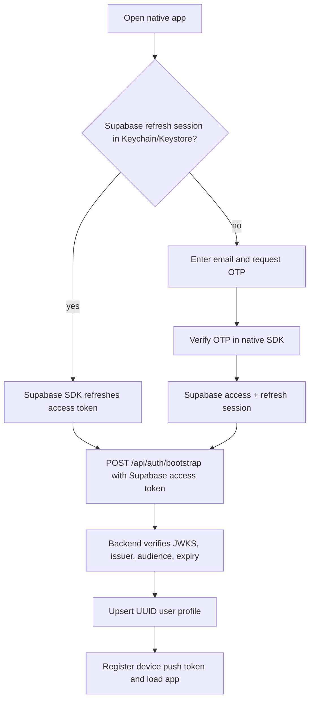
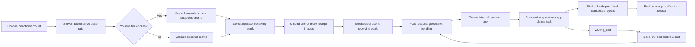
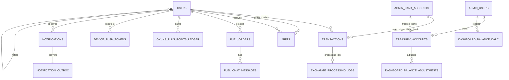
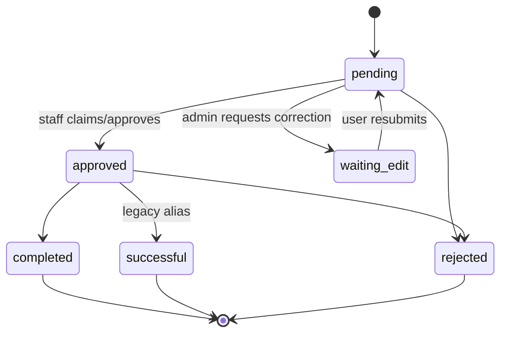

# OYUNS ALL-IN-ONE — Rebuild Specification
> Native-mobile rebuild target derived from the repository as it exists on 2026-08-03. Existing financial behavior remains authoritative, but all messenger-platform authentication, SDK, bot, chat-group, and notification behavior is intentionally excluded. The replacement application is a first-class iOS/Android client using Supabase Auth, native navigation, secure credential storage, universal/app links, APNs/FCM push delivery, and an internal operator work queue. “Declared” identifies legacy checked-in SQL; “target” identifies the schema and behavior that the mobile rebuild must implement.

## 1. Product Summary & Core Goals

### 1.1 Core app objective and users

OYUNS ALL-IN-ONE is a Mongolian/Russian bilingual native iOS/Android application for an operator-assisted financial service. It lets an authenticated mobile user:

- exchange RUB to MNT (`direction=buy`, user gives RUB and receives MNT) or MNT to RUB (`directffion=sell`, user gives MNT and receives RUB);
- submit proof of payment, receive operator proof, track the request, and correct a request returned as `waiting_edit`;
- register in two stages, verify email through Supabase Auth OTP, and submit bank/passport data for manual KYC;
- buy a gift transfer for another registered user, buy discounted fuel, request Russian mobile-phone top-up, or contact the operator for airline tickets;
- earn OYUNS+ points and referral rewards, and inspect points/history;
- inspect exchange history, volume analytics, and the current rate.

The customer app has no operator/admin screens. Exchange/KYC operations, fuel operations, and finance/management are companion surfaces: they may remain in the existing operations/Telegram app or be rebuilt as separate role-specific native apps/web applications. Their APIs, data, permissions, calculations, and workflows remain specified in §§2, 4, and 6, but are not compiled into or navigable from the customer app; the customer app itself contains no Telegram SDK or messenger logic.

The backend is a FastAPI service backed by Supabase/Postgres, Supabase Auth, and Supabase Storage. A durable worker processes notifications, reminders, rates, and internal operator jobs. APNs and FCM deliver customer push notifications; operator queue notifications are delivered only to the separate operations surface.

#### Native customer-app scope boundary

The customer application contains Home, Activity, Exchange, Services, OYUNS+, Rewards, Profile, KYC submission, receipt/proof upload, fuel-order tracking, gift confirmation, notifications, and support. It does **not** contain the exchange admin panel, finance dashboard, fuel admin panel, staff queue, KYC approval controls, bank/station CRUD, treasury/profit tools, rate imports, or operator shift controls. A role-bearing user opens those capabilities in a separately distributed operations app or retained operations client; no customer-app route or role gate exposes them.

### 1.2 Primary end-to-end workflows

#### Authentication and first use



Development builds may use a Supabase local/test project and seeded test accounts. Production builds must not contain mock identities, bypass tokens, hard-coded users, or authentication toolbars.

#### Registration, email verification, and KYC

1. A newly authenticated Supabase user has `verification_level=0` until the required profile fields and terms acceptance are saved.
2. Email possession is established by Supabase Auth before profile creation. Quick registration collects last name, first name, international phone, terms acceptance, and an optional referral code, then promotes the profile to level 1 without operator approval.
3. The native Supabase SDK owns OTP entry, link handling, refresh, and sign-out. The API trusts only a verified Supabase access token; it never accepts an identity object or an email-verification token in a request body.
4. Full KYC collects MNT bank details, optional RUB bank details, and a passport image. It sets `ready_for_verification=true`; an exchange/KYC operator in the companion app approves or rejects.
5. Companion-app approval sets `verified=true`, `verification_level=2`, and awards/refines referral benefits. Rejection clears readiness and can notify the user.
6. A fully verified user who edits protected bank information is put back into a re-verification state; MNT→RUB is locked until approval.

#### Currency exchange



The client previews pricing, but the backend reloads the latest rate, validates the promo, applies volume rules, and ignores a client rate except as a fallback when no stored rate exists. Receipts are uploaded directly to private Supabase Storage using a signed upload URL. The transaction records storage paths as a JSON list in `bill_url` and the first item in legacy `receipt_id`; read APIs return short-lived authorized download URLs.

#### Gift

Select card → locate an already registered recipient by normalized phone → choose RUB→MNT or MNT→RUB and amount → choose matching admin bank → upload sender receipt → create `pending_recipient` gift → recipient supplies receiving bank → `pending_admin` → operator preapproves/finalizes or approves/rejects → sender and recipient receive durable in-app notifications plus push alerts. The target schema must explicitly include the `preapproved` state and fields.

#### Fuel

Choose/history/track order → choose station and optional dispenser → capture GPS or enter address → enter liters and pump price → calculate discount → choose RUB/MNT → choose fuel-admin bank and upload payment receipt → create order → fuel staff approves with QR/image or rejects → user uploads pump photo, chats with staff, and order moves toward completion. The customer app polls its own order; the separate fuel operations app polls its queue. There is no Realtime subscription required for correctness.

#### Phone top-up and ticketing

Phone top-up collects RUB credit amount, Russian phone, telecom, MNT receiving bank, and receipt. It is stored as an ordinary MNT→RUB transaction with `bank_details="phone, telecom"`; dashboard/admin classification detects the two-part form. Ticket booking opens a configurable `mailto:`, `tel:`, HTTPS support page, or in-app support screen through the native linking API. Finance staff separately record ticket sales in the dashboard for profit accounting.

#### OYUNS+ loyalty

Completed exchange volume produces idempotent points ledger entries. Referral codes have a configurable maximum use count and award points. The OYUNS+ screen shows balance, referral link/code, ledger history, and points history.

#### Companion operator workflows (not included in the customer app)

- Separate exchange operations app: authenticate as staff; open/transfer/close shift; configure working hours, exchange limits, internal processing, banner, OYUNS+ settings, and bank rotation; claim/triage transactions; set user labels; return requests for correction; finish/reject with proof; manage KYC, users, bank accounts, gifts, and history.
- Separate fuel operations app: authenticate as staff; operate shift/notification assignment; manage stations and banks; approve/reject orders; upload approval image; chat; review history.
- Separate finance app/dashboard: authenticate as finance staff; filter/export transaction analytics; maintain treasury accounts and daily entered balances; add tagged adjustments; import black rates from Sheets; enter USD cost rates; record ticket sales; inspect transaction and aggregate profit.

### 1.3 Native mobile capabilities

| Capability | Required use |
|---|---|
| Supabase native Auth SDK | Email OTP/magic-link authentication, access-token refresh, sign-out, and recovery. |
| Keychain / Android Keystore | OS-protected storage for refresh credentials; never store tokens in ordinary preferences. |
| APNs / FCM | Customer transaction, gift, fuel, KYC, correction, and reminder push notifications. Push is advisory; in-app notification state remains authoritative. Operator queue notifications belong to the separate operations app. |
| Universal Links / Android App Links | Open exchange correction, gift confirmation, fuel tracking, and support destinations in the customer app. Staff-task links are handled only by the separate operations app. |
| Native navigation and back gestures | Stack/tab navigation, modal dismissal, state restoration, and platform back behavior. |
| Native haptics | Success/warning/error feedback for submission, copy, validation, and status changes; respect reduced-motion/haptic settings. |
| Camera, photo picker, and image pipeline | Passport, receipt, proof, pump, banner, and approval-image selection; strip metadata where appropriate and compress before signed upload. |
| Location services | Fuel-station GPS capture with explicit permission states and manual-address fallback. |
| Secure clipboard/share/linking APIs | Copy account data, share referral links, and open configured phone/email/HTTPS support targets. |
| Appearance and localization | System light/dark mode with optional override; Mongolian/Russian resources and locale-safe number/date formatting. |
| Payments | No app-store or platform payment SDK. Transfers remain operator bank transfers with receipt proof. |

## 2. Complete Database & Data Architecture (Supabase / Postgres)

### 2.1 Reconstruction status and conventions

The repository is not a self-contained database history. The native rebuild must consolidate the additive migrations into one ordered schema, rename the rate table to `exchange_rates`, and omit all messenger-session/group tables. SQL uses `gen_random_uuid()` and therefore requires `pgcrypto` in a clean database. No native Postgres enum is required; enum behavior may remain `VARCHAR/TEXT` plus `CHECK` constraints.

`timestamptz` is required for all operational timestamps. Currency values are `numeric`, not binary floats. Every user/staff identity is UUID and anchored to `auth.users(id)`; mobile installation IDs and push tokens are strings, never identity keys.

### 2.2 Core target schema

These definitions preserve all financial fields while replacing platform-owned identities and delivery state with native-mobile equivalents.

```sql
CREATE TABLE users (
  id UUID PRIMARY KEY REFERENCES auth.users(id) ON DELETE CASCADE,
  first_name TEXT, last_name TEXT,
  email VARCHAR(255) NOT NULL, phone TEXT, phone_mnt TEXT, phone_intl VARCHAR(30),
  bank_rub TEXT, bank_mnt TEXT,                  -- serialized comma/bullet-delimited bank fields
  passport_storage_url TEXT,
  agreed_terms BOOLEAN NOT NULL DEFAULT FALSE, terms_version TEXT, terms_agreed_at TIMESTAMPTZ,
  ready_for_verification BOOLEAN NOT NULL DEFAULT FALSE,
  verified BOOLEAN NOT NULL DEFAULT FALSE,
  verification_level INTEGER NOT NULL DEFAULT 0,
  email_verified_at TIMESTAMPTZ,
  lang TEXT DEFAULT 'mn',
  referral_code VARCHAR(16) UNIQUE,
  referred_by_user_id UUID REFERENCES users(id) ON DELETE SET NULL,
  referred_by_code VARCHAR(16),
  admin_label VARCHAR(30), admin_label_note TEXT,
  created_at TIMESTAMPTZ DEFAULT NOW(), updated_at TIMESTAMPTZ DEFAULT NOW()
);

CREATE TABLE transactions (
  id UUID PRIMARY KEY DEFAULT gen_random_uuid(),
  user_id UUID NOT NULL REFERENCES users(id),
  invoice TEXT NOT NULL UNIQUE,
  amount NUMERIC NOT NULL,
  currency_from TEXT NOT NULL, currency_to TEXT NOT NULL,
  rate NUMERIC NOT NULL, buy_rate NUMERIC, sell_rate NUMERIC,
  status TEXT NOT NULL DEFAULT 'pending',
  timestamp TIMESTAMPTZ NOT NULL DEFAULT NOW(),
  bank_details TEXT, promo_code TEXT,
  bill_url TEXT, receipt_id TEXT, admin_bill_url TEXT,
  rejection_comment TEXT, admin_comment TEXT,
  completed_by_admin UUID,                       -- FK added after admin_users is created
  admin_bank_id UUID REFERENCES admin_bank_accounts(id) ON UPDATE CASCADE ON DELETE SET NULL,
  receipt_submitted_at TIMESTAMPTZ,
  completed_at TIMESTAMPTZ, admin_bill_submitted_at TIMESTAMPTZ,
  completion_duration_minutes NUMERIC,
  waiting_started_at TIMESTAMPTZ,
  timer_paused_at TIMESTAMPTZ,
  total_paused_seconds NUMERIC NOT NULL DEFAULT 0,
  CONSTRAINT transactions_status_check CHECK (status IN
    ('pending','approved','completed','successful','rejected','waiting_edit'))
);

CREATE TABLE exchange_rates (
  id BIGSERIAL PRIMARY KEY,
  buy_rate NUMERIC NOT NULL,
  sell_rate NUMERIC NOT NULL,
  updated_at TIMESTAMPTZ NOT NULL DEFAULT NOW()
);

CREATE TABLE promo_codes (
  id UUID PRIMARY KEY DEFAULT gen_random_uuid(),
  code TEXT NOT NULL UNIQUE,
  aliases TEXT[] DEFAULT '{}',
  discount NUMERIC NOT NULL,
  active BOOLEAN NOT NULL DEFAULT TRUE,
  created_at TIMESTAMPTZ DEFAULT NOW(), expires_at TIMESTAMPTZ,
  user_id UUID REFERENCES users(id),
  source TEXT, source_id TEXT,            -- default, referral, compensation, etc.
  UNIQUE(user_id, source, source_id)
);

CREATE TABLE admin_users (
  id UUID PRIMARY KEY REFERENCES users(id) ON DELETE CASCADE,
  name TEXT NOT NULL, role TEXT NOT NULL CHECK (role IN ('exchange_admin','fuel_admin','finance_admin','super_admin')),
  is_active BOOLEAN NOT NULL DEFAULT TRUE
);
CREATE TABLE admin_shifts (
  id INTEGER PRIMARY KEY DEFAULT 1 CHECK (id=1),
  current_admin_id UUID REFERENCES admin_users(id), last_updated TIMESTAMPTZ
);
CREATE TABLE admin_activity_logs (
  id BIGSERIAL PRIMARY KEY, action_type TEXT NOT NULL,
  performed_by_admin_id UUID NOT NULL REFERENCES admin_users(id), target_admin_id UUID REFERENCES admin_users(id),
  previous_admin_id UUID REFERENCES admin_users(id), is_automatic BOOLEAN NOT NULL DEFAULT FALSE,
  timestamp TIMESTAMPTZ NOT NULL DEFAULT NOW()
);
ALTER TABLE transactions ADD CONSTRAINT transactions_completed_by_admin_fkey
  FOREIGN KEY (completed_by_admin) REFERENCES admin_users(id) ON DELETE SET NULL;
CREATE TABLE device_push_tokens (
  id UUID PRIMARY KEY DEFAULT gen_random_uuid(), user_id UUID NOT NULL REFERENCES users(id) ON DELETE CASCADE,
  installation_id TEXT NOT NULL, platform TEXT NOT NULL CHECK (platform IN ('ios','android')),
  push_provider TEXT NOT NULL CHECK (push_provider IN ('apns','fcm')), token TEXT NOT NULL,
  app_version TEXT, locale TEXT, enabled BOOLEAN NOT NULL DEFAULT TRUE,
  last_seen_at TIMESTAMPTZ NOT NULL DEFAULT NOW(), created_at TIMESTAMPTZ NOT NULL DEFAULT NOW(),
  UNIQUE(installation_id), UNIQUE(push_provider, token)
);
CREATE TABLE notifications (
  id UUID PRIMARY KEY DEFAULT gen_random_uuid(), user_id UUID NOT NULL REFERENCES users(id) ON DELETE CASCADE,
  type TEXT NOT NULL, title_key TEXT NOT NULL, body_key TEXT NOT NULL,
  data JSONB NOT NULL DEFAULT '{}', deep_link TEXT,
  read_at TIMESTAMPTZ, created_at TIMESTAMPTZ NOT NULL DEFAULT NOW()
);
CREATE TABLE notification_outbox (
  id UUID PRIMARY KEY DEFAULT gen_random_uuid(), notification_id UUID NOT NULL UNIQUE REFERENCES notifications(id) ON DELETE CASCADE,
  status TEXT NOT NULL DEFAULT 'queued' CHECK (status IN ('queued','sending','sent','failed','dead_letter')),
  attempts INTEGER NOT NULL DEFAULT 0, next_attempt_at TIMESTAMPTZ NOT NULL DEFAULT NOW(),
  lease_expires_at TIMESTAMPTZ, provider_message_ids JSONB NOT NULL DEFAULT '[]', last_error TEXT,
  created_at TIMESTAMPTZ NOT NULL DEFAULT NOW(), sent_at TIMESTAMPTZ
);
```

### 2.3 Declared exchange administration and settings tables

```sql
CREATE TABLE admin_bank_accounts (
  id UUID PRIMARY KEY DEFAULT gen_random_uuid(),
  bank_name VARCHAR(100) NOT NULL,
  account_number VARCHAR(50), card_number VARCHAR(20), phone VARCHAR(20),
  owner_name VARCHAR(100) NOT NULL,
  currency VARCHAR(3) NOT NULL CHECK (currency IN ('RUB','MNT')),
  is_active BOOLEAN DEFAULT TRUE,
  display_order INTEGER DEFAULT 0,
  created_at TIMESTAMPTZ DEFAULT NOW(), updated_at TIMESTAMPTZ DEFAULT NOW(),
  logo_url TEXT, is_priority BOOLEAN DEFAULT FALSE,
  admin_id UUID REFERENCES admin_users(id) ON DELETE SET NULL
);

CREATE TABLE working_hours (
  id INTEGER PRIMARY KEY DEFAULT 1 CHECK (id=1),
  start_hour_moscow INTEGER NOT NULL DEFAULT 4 CHECK (start_hour_moscow BETWEEN 0 AND 24),
  end_hour_moscow INTEGER NOT NULL DEFAULT 24 CHECK (end_hour_moscow BETWEEN 0 AND 24),
  is_enabled BOOLEAN DEFAULT TRUE,
  updated_at TIMESTAMPTZ DEFAULT NOW(), updated_by UUID REFERENCES admin_users(id)
);

CREATE TABLE app_settings (
  key TEXT PRIMARY KEY, value TEXT NOT NULL, description TEXT,
  updated_at TIMESTAMPTZ DEFAULT NOW()
);

CREATE TABLE admin_actions (
  id BIGSERIAL PRIMARY KEY, admin_user_id UUID NOT NULL REFERENCES admin_users(id),
  action_type VARCHAR(50) NOT NULL, target_type VARCHAR(50), target_id VARCHAR(255),
  details JSONB, created_at TIMESTAMPTZ DEFAULT NOW()
);
```

Required `app_settings` keys and defaults are:

| Key | Default/meaning |
|---|---|
| `min_rub_amount` | `5000`; minimum RUB-equivalent for MNT→RUB exchange/gift. |
| `min_rub_buy` | `100`; minimum RUB amount for RUB→MNT. |
| `oyuns_plus_enabled` | `1`. |
| `oyuns_plus_threshold_rub` | `10000`. |
| `oyuns_plus_points_per_threshold` | `10`. |
| `oyuns_plus_referral_reward_points` | `50`. |
| `oyuns_plus_referral_max_uses` | `5`. |
| `oyuns_plus_logo_url` | Optional public logo URL. |
| `rub_bank_rotation_counter` | `0`; increments to rotate non-priority RUB banks. |
| `home_banner_enabled`, `home_banner_image_url`, `home_banner_link_url` | `0`, empty, empty. |
| `support_url`, `support_email`, `support_phone` | Native linking targets; at least one must be configured for ticket/support contact. |
| `operator_queue_enabled` | `1`; enables creation of internal exchange processing tasks. |

### 2.4 Gift schema

```sql
CREATE TABLE gifts (
  id UUID PRIMARY KEY DEFAULT gen_random_uuid(), invoice VARCHAR(50) UNIQUE NOT NULL,
  sender_user_id UUID NOT NULL REFERENCES users(id),
  recipient_user_id UUID REFERENCES users(id),
  recipient_phone VARCHAR(50) NOT NULL, recipient_name VARCHAR(255),
  gift_card_url TEXT NOT NULL,
  message TEXT CHECK (char_length(message) <= 1000), from_name VARCHAR(100),
  direction VARCHAR(10) NOT NULL CHECK (direction IN ('buy','sell')),
  amount NUMERIC(18,2) NOT NULL, currency_from VARCHAR(10) NOT NULL,
  currency_to VARCHAR(10) NOT NULL, rate NUMERIC(18,4) NOT NULL,
  admin_bank_id TEXT, sender_receipt_url TEXT, recipient_bank_details TEXT,
  admin_bill_url TEXT, rejection_comment TEXT, completed_by_admin UUID REFERENCES admin_users(id),
  status VARCHAR(20) NOT NULL DEFAULT 'pending_recipient'
    CHECK (status IN ('pending_recipient','pending_admin','approved','completed','rejected')),
  created_at TIMESTAMPTZ DEFAULT NOW(), updated_at TIMESTAMPTZ DEFAULT NOW(),
  confirmed_at TIMESTAMPTZ, completed_at TIMESTAMPTZ,
  preapproved_at TIMESTAMPTZ, preapproved_by_admin UUID REFERENCES admin_users(id)
);
CREATE INDEX idx_gifts_sender ON gifts(sender_user_id);
CREATE INDEX idx_gifts_recipient ON gifts(recipient_user_id);
CREATE INDEX idx_gifts_status ON gifts(status);
CREATE INDEX idx_gifts_invoice ON gifts(invoice);
CREATE INDEX idx_gifts_recipient_phone ON gifts(recipient_phone);

CREATE TABLE gift_cards (
  id SERIAL PRIMARY KEY, name VARCHAR(255) NOT NULL, image_url TEXT NOT NULL,
  is_active BOOLEAN DEFAULT TRUE, display_order INTEGER DEFAULT 0,
  created_at TIMESTAMPTZ DEFAULT NOW()
);
```

Five seed card rows are declared: birthday, general, two Tsagaan Sar, and Valentine images in the public `gift_card` bucket. To match runtime behavior, a rebuild must extend the gift status constraint with `preapproved`, because `/admin/gift/{id}/preapprove` writes that value.

### 2.5 Fuel schema

```sql
CREATE TABLE fuel_stations (
  id UUID PRIMARY KEY DEFAULT gen_random_uuid(), name VARCHAR(100) UNIQUE NOT NULL,
  discount_percent INTEGER NOT NULL DEFAULT 13, is_active BOOLEAN DEFAULT TRUE,
  requires_dispenser BOOLEAN DEFAULT FALSE, display_order INTEGER DEFAULT 0,
  created_at TIMESTAMPTZ DEFAULT NOW(), updated_at TIMESTAMPTZ DEFAULT NOW()
);

CREATE TABLE fuel_orders (
  id UUID PRIMARY KEY DEFAULT gen_random_uuid(), invoice VARCHAR(50) UNIQUE NOT NULL,
  user_id UUID NOT NULL REFERENCES users(id),
  station_name VARCHAR(100) NOT NULL, dispenser_number VARCHAR(20),
  station_latitude DOUBLE PRECISION, station_longitude DOUBLE PRECISION, location_text TEXT,
  liters NUMERIC(10,2) NOT NULL, station_price_per_liter NUMERIC(10,2) NOT NULL,
  discount_percent INTEGER NOT NULL DEFAULT 13,
  gross_amount NUMERIC(18,2) NOT NULL, discount_amount NUMERIC(18,2) NOT NULL,
  net_amount NUMERIC(18,2) NOT NULL, rounded_amount NUMERIC(18,2) NOT NULL,
  payment_currency VARCHAR(3) NOT NULL CHECK (payment_currency IN ('RUB','MNT')),
  exchange_rate NUMERIC(18,4), final_amount NUMERIC(18,2) NOT NULL,
  payment_receipt_url TEXT, pump_photo_url TEXT, approval_image_url TEXT,
  admin_bank_id UUID, admin_bank_name VARCHAR(100), admin_bank_owner VARCHAR(100), admin_bank_card VARCHAR(50),
  status VARCHAR(30) NOT NULL DEFAULT 'pending' CHECK (status IN
    ('pending','pending_payment','paid','approved','in_progress','fueling_complete','completed','rejected','cancelled')),
  rejection_comment TEXT, admin_comment TEXT, completed_by_admin UUID REFERENCES admin_users(id),
  created_at TIMESTAMPTZ DEFAULT NOW(), updated_at TIMESTAMPTZ DEFAULT NOW(), completed_at TIMESTAMPTZ
);

CREATE TABLE fuel_admin_bank_accounts (
  id UUID PRIMARY KEY DEFAULT gen_random_uuid(), bank_name VARCHAR(100) NOT NULL,
  account_number VARCHAR(50), card_number VARCHAR(20), phone VARCHAR(20),
  owner_name VARCHAR(100) NOT NULL,
  currency VARCHAR(3) NOT NULL CHECK (currency IN ('RUB','MNT')),
  is_active BOOLEAN DEFAULT TRUE, display_order INTEGER DEFAULT 0,
  created_at TIMESTAMPTZ DEFAULT NOW(), updated_at TIMESTAMPTZ DEFAULT NOW(),
  admin_id UUID REFERENCES admin_users(id), logo_url TEXT, is_primary BOOLEAN DEFAULT FALSE
);

CREATE TABLE fuel_chat_messages (
  id UUID PRIMARY KEY DEFAULT gen_random_uuid(),
  fuel_order_id UUID NOT NULL REFERENCES fuel_orders(id) ON DELETE CASCADE,
  sender_type VARCHAR(10) NOT NULL CHECK (sender_type IN ('user','admin')),
  sender_user_id UUID REFERENCES users(id), sender_admin_id UUID REFERENCES admin_users(id),
  message TEXT, image_url TEXT, created_at TIMESTAMPTZ DEFAULT NOW(),
  CHECK ((sender_type='user' AND sender_user_id IS NOT NULL AND sender_admin_id IS NULL)
      OR (sender_type='admin' AND sender_admin_id IS NOT NULL AND sender_user_id IS NULL))
);

CREATE TABLE fuel_admin_shift (
  id TEXT PRIMARY KEY DEFAULT 'current', is_active BOOLEAN NOT NULL DEFAULT TRUE,
  admin_id UUID REFERENCES admin_users(id), admin_name TEXT,
  updated_at TIMESTAMPTZ DEFAULT NOW(),
  always_notify_admin_id UUID REFERENCES admin_users(id)
);
```

Seed stations are Rosneft, Bashneft, TNK, Gazpromneft, Lukoil, Tatneft, Topline (13%), and NNK (10%); the last three require a dispenser number.

### 2.6 Internal operator queue and loyalty

```sql
CREATE TABLE exchange_processing_jobs (
  id UUID PRIMARY KEY DEFAULT gen_random_uuid(),
  transaction_id UUID NOT NULL UNIQUE REFERENCES transactions(id) ON DELETE CASCADE,
  invoice TEXT NOT NULL UNIQUE,
  direction TEXT NOT NULL CHECK (direction IN ('mnt_to_rub','rub_to_mnt')),
  status TEXT NOT NULL DEFAULT 'queued' CHECK (status IN ('queued','claimed','processing','completed','failed')),
  attempts INTEGER NOT NULL DEFAULT 0,
  next_attempt_at TIMESTAMPTZ NOT NULL DEFAULT NOW(), lease_expires_at TIMESTAMPTZ,
  last_error TEXT,
  claimed_by UUID REFERENCES admin_users(id) ON DELETE SET NULL,
  proof_urls JSONB NOT NULL DEFAULT '[]', completion_amount NUMERIC(18,2),
  created_at TIMESTAMPTZ NOT NULL DEFAULT NOW(), updated_at TIMESTAMPTZ NOT NULL DEFAULT NOW(),
  claimed_at TIMESTAMPTZ, completed_at TIMESTAMPTZ
);

CREATE TABLE oyuns_plus_points_ledger (
  id UUID PRIMARY KEY DEFAULT gen_random_uuid(), user_id UUID NOT NULL REFERENCES users(id) ON DELETE CASCADE,
  source_type VARCHAR(32) NOT NULL, source_id VARCHAR(120) NOT NULL, points INTEGER NOT NULL CHECK (points <> 0),
  rub_equivalent NUMERIC(18,2), metadata JSONB NOT NULL DEFAULT '{}', created_at TIMESTAMPTZ NOT NULL DEFAULT NOW(),
  UNIQUE(user_id, source_type, source_id)
);

```

### 2.7 Finance dashboard schema

```sql
CREATE TABLE treasury_accounts (
  id UUID PRIMARY KEY DEFAULT gen_random_uuid(), name TEXT NOT NULL,
  admin_id UUID REFERENCES admin_users(id) ON UPDATE CASCADE ON DELETE SET NULL,
  admin_bank_id UUID REFERENCES admin_bank_accounts(id) ON UPDATE CASCADE ON DELETE SET NULL,
  prev_balance NUMERIC NOT NULL DEFAULT 0,
  rub_to_mnt NUMERIC NOT NULL DEFAULT 0, mnt_to_rub NUMERIC NOT NULL DEFAULT 0,
  baseline_rub_to_mnt NUMERIC NOT NULL DEFAULT 0, baseline_mnt_to_rub NUMERIC NOT NULL DEFAULT 0,
  adjustment NUMERIC NOT NULL DEFAULT 0, entered_balance NUMERIC, balance_date DATE,
  currency TEXT NOT NULL DEFAULT 'RUB', is_active BOOLEAN NOT NULL DEFAULT TRUE,
  display_order INTEGER NOT NULL DEFAULT 0,
  created_at TIMESTAMPTZ NOT NULL DEFAULT NOW(), updated_at TIMESTAMPTZ NOT NULL DEFAULT NOW()
);
CREATE TABLE dashboard_balance_daily (
  admin_id UUID NOT NULL REFERENCES admin_users(id) ON UPDATE CASCADE ON DELETE CASCADE,
  balance_date DATE NOT NULL, opening_balance NUMERIC NOT NULL DEFAULT 0,
  entered_balance NUMERIC, created_at TIMESTAMPTZ NOT NULL DEFAULT NOW(),
  updated_at TIMESTAMPTZ NOT NULL DEFAULT NOW(), PRIMARY KEY(admin_id,balance_date)
);
CREATE TABLE dashboard_balance_history (
  row_key TEXT PRIMARY KEY, balance_date DATE NOT NULL,
  scope_type TEXT NOT NULL CHECK (scope_type IN ('all','admin')),
  admin_id UUID REFERENCES admin_users(id) ON UPDATE CASCADE ON DELETE SET NULL, admin_name TEXT,
  opening_balance NUMERIC NOT NULL DEFAULT 0, rub_to_mnt_rub NUMERIC NOT NULL DEFAULT 0,
  mnt_to_rub_rub NUMERIC NOT NULL DEFAULT 0, adjustment_total NUMERIC NOT NULL DEFAULT 0,
  calculated_balance NUMERIC NOT NULL DEFAULT 0, entered_balance NUMERIC, discrepancy NUMERIC,
  created_at TIMESTAMPTZ NOT NULL DEFAULT NOW(), updated_at TIMESTAMPTZ NOT NULL DEFAULT NOW()
);
CREATE TABLE dashboard_balance_adjustments (
  id UUID PRIMARY KEY DEFAULT gen_random_uuid(),
  admin_id UUID NOT NULL REFERENCES admin_users(id) ON UPDATE CASCADE ON DELETE CASCADE,
  treasury_account_id UUID REFERENCES treasury_accounts(id) ON UPDATE CASCADE ON DELETE CASCADE,
  balance_date DATE NOT NULL, amount NUMERIC NOT NULL, tag TEXT NOT NULL, description TEXT,
  created_at TIMESTAMPTZ NOT NULL DEFAULT NOW(), updated_at TIMESTAMPTZ NOT NULL DEFAULT NOW()
);
CREATE TABLE cost_rates (
  rate_date DATE PRIMARY KEY, usd_rate NUMERIC, black_rate NUMERIC,
  cost_rate NUMERIC, updated_at TIMESTAMPTZ NOT NULL DEFAULT NOW()
);
CREATE TABLE plane_ticket_sales (
  id UUID PRIMARY KEY DEFAULT gen_random_uuid(), sale_date DATE NOT NULL,
  sold_price_mnt NUMERIC NOT NULL, exchange_rate NUMERIC NOT NULL, cost_rate NUMERIC NOT NULL,
  rub_equivalent NUMERIC NOT NULL DEFAULT 0, profit_mnt NUMERIC NOT NULL DEFAULT 0,
  note TEXT, created_at TIMESTAMPTZ NOT NULL DEFAULT NOW(), updated_at TIMESTAMPTZ NOT NULL DEFAULT NOW()
);
```

`storage_upload_issues` is an operational diagnostic table: `BIGSERIAL` PK, `created_at`, non-null issue type/bucket/path/message, nullable UUID user id, non-null `details JSONB DEFAULT '{}'`, and non-null `request_context JSONB DEFAULT '{}'`; indexes cover created time, user and issue type.

### 2.8 Relationships



### 2.9 RLS, functions, triggers, and storage

Target RLS must be fail-closed and use `auth.uid()`; mobile clients never receive the service-role key.

| Table group | Client policy |
|---|---|
| `users` | Authenticated user may SELECT/INSERT/UPDATE only the row where `id=auth.uid()`; protected verification, role, label, referral-award, and audit fields are updated only by service-role RPC/API. |
| `transactions`, `fuel_orders`, `oyuns_plus_points_ledger`, `promo_codes` | User may SELECT rows where `user_id=auth.uid()`. Creation and every financial/status mutation goes through FastAPI; no direct client write policy. |
| `gifts` | User may SELECT rows where sender or recipient equals `auth.uid()`; confirmation and mutations go through API ownership checks. |
| `fuel_chat_messages` | User may SELECT messages only when the parent order belongs to `auth.uid()` and INSERT only user messages for that order; staff access is role-based. |
| `device_push_tokens` | User may SELECT/INSERT/UPDATE/DELETE only rows where `user_id=auth.uid()`; API additionally binds installation ownership. |
| `notifications` | User may SELECT own rows and UPDATE only `read_at`; creation/deletion is service-only. |
| Public reference data | Authenticated clients may SELECT active banks, cards, stations, public settings, and rates. No public writes. |
| `admin_users` and all admin/finance/queue/audit tables | Access requires an active `admin_users` row and the precise role checked by a `SECURITY DEFINER has_staff_role(required_roles text[])` helper; otherwise service-role only. |

Functions/triggers:

- `update_updated_at_column()` sets `NEW.updated_at=NOW()` on every mutable table with `updated_at`.
- `update_app_settings_timestamp()` sets the settings timestamp.
- `has_staff_role(required_roles text[])` checks `auth.uid()` against active staff membership, uses a fixed `search_path`, is not executable by anon, and never trusts a client-supplied admin id.
- `claim_exchange_processing_job(p_job_id uuid)` atomically changes `queued→claimed`, assigns `auth.uid()`, sets a lease, and refuses users lacking exchange/super-admin role.
- `complete_exchange_processing_job(...)` locks the job and transaction, verifies claimant/role/status, stores proof, completes the transaction once, writes points/promos/audit/notification rows, and commits atomically.
- An outbox trigger or explicit transaction writes `notification_outbox` work whenever a durable `notifications` row is created; a worker delivers APNs/FCM and records attempts without coupling push success to the business transaction.

Storage buckets are `passports`, `bills`, and `gift_card`; logical paths include exchange direction folders, `gift_receipts`, fuel receipts/pump/approval images, and home banners. Passport/receipt/proof objects are private. Rows store canonical object paths, and the API returns short-lived signed read URLs only after ownership/role checks. Public branding assets may use a dedicated public bucket. Historical absolute URLs must be migrated to paths before launch.

### 2.10 Database drift and rebuild hazards

- `database/schema_updates.sql` contains mixed/corrupted encodings: its beginning is ASCII and later text is UTF-16-like. Do not execute it blindly. Its recoverable intent is admin bank accounts, working hours, triggers, and later transaction/treasury FKs.
- `admin_bank_accounts.admin_id` is required by runtime/API types but has no valid checked-in migration.
- Gifts write `status='preapproved'` and preapproval fields absent from `gifts_table.sql`.
- Fuel SQL comments say “ceil to 100”; executable Python uses `round(net/100)*100` (banker’s rounding).
- The fuel RLS policy names imply ownership but their predicates are unconditional.
- `AdminShiftResponse` declares `is_shift_active` twice in Pydantic; the duplicate collapses to one field.
- `OyunsPlusHistoryEntry.id` is typed as `Optional[int]` in both Pydantic and the frontend, while `oyuns_plus_points_ledger.id` is UUID. Returning a real ledger row can therefore fail response validation unless this model is corrected to `str`/UUID.
- No migration runner is wired into Docker/deploy; SQL files are manual Supabase SQL-editor scripts.

These are migration inputs, not target permissions or defects. The consolidated target schema above resolves each mismatch before any production data is imported.

## 3. Authentication & Authorization Flow

### 3.1 Native authentication

Supabase Auth is the sole identity provider. The mobile app requests an email OTP or magic link through the platform SDK, verifies it in the SDK, and receives a short-lived access token plus rotating refresh token. The API accepts only `Authorization: Bearer <supabase_access_token>`.

The FastAPI dependency validates the JWT locally against the project JWKS and checks algorithm, signature, issuer, `aud=authenticated`, `sub` UUID, expiry, and not-before time. On first authenticated request, `POST /api/auth/bootstrap` inserts `users.id=sub`, copies the normalized verified email, and returns profile-completion state. Client-supplied identity fields never determine the authenticated user.

### 3.2 Session lifecycle and secure persistence

- The Supabase native SDK stores refresh credentials in iOS Keychain or Android Keystore-backed encrypted storage.
- Access tokens remain in memory and are refreshed before expiry. A request receiving 401 waits for one shared refresh operation and retries once; concurrent requests do not independently refresh.
- If refresh returns an invalid/revoked session, the app clears secure credentials, unregisters or disables the current device push token, clears sensitive caches, and returns to the sign-in screen.
- Sign-out calls Supabase global or local sign-out according to the user choice, unregisters the installation, and clears cached profile/financial data.
- App foregrounding validates session state before showing protected data. Background snapshots obscure monetary and passport screens.
- Deep links received before authentication are retained only as a validated route intent and resumed after login; resource ownership is always rechecked by the API.

### 3.3 Registration and verified email

Email is verified as part of Supabase sign-in, so the separate email-verification start/complete API is removed. `/api/register-basic` receives profile fields only and may promote an authenticated, email-verified account from level 0 to level 1. Changing the login email uses Supabase Auth's secure email-change flow and must not be implemented as an ordinary profile mutation.

### 3.4 Roles and permissions

| Role | Capabilities |
|---|---|
| Authenticated user | Own profile, exchanges, gifts involving the user, fuel orders/chat, loyalty entries, uploads, devices, and notifications. |
| `exchange_admin` | Exchange queue, KYC, users, exchange banks/settings/shifts, gifts, proof and status actions. |
| `fuel_admin` | Fuel queue, stations, fuel banks, fuel shift/chat/actions. |
| `finance_admin` | Dashboard transactions, balances, treasury, rates, tickets, imports, exports, profit. |
| `super_admin` | Union of staff permissions plus staff membership management. |

The API loads the active `admin_users` row for `auth.uid()` and enforces a route-specific role dependency. UUIDs in request bodies identify business targets, never the acting administrator; audit rows always use the authenticated subject. There are no shared admin keys, impersonation fallbacks, client-side-only gates, or hard-coded production users.

### 3.5 Device and push authorization

After notification permission is resolved, the app calls `PUT /api/devices/current` with installation id, platform, provider token, app version, and locale. The API binds the installation to `auth.uid()`. Token rotation updates the same installation; logout disables it. Push payloads contain only notification id, type, and opaque route identifiers—never passport data, full bank details, receipt URLs, or access tokens.

### 3.6 Security requirements

- RLS and API dependencies fail closed and are tested for cross-user and cross-role access.
- The service-role key exists only on backend/worker hosts. Mobile binaries contain only the public Supabase URL and anon/publishable key.
- Signed-upload paths are server-generated beneath an authenticated user or business-object namespace; clients cannot choose arbitrary paths.
- Production API CORS is limited to retained web-admin origins. Native clients do not require CORS.
- Certificate trust uses normal platform TLS validation; certificate pinning is optional only with a documented rotation/recovery strategy.
- Sensitive local fields are encrypted at rest by platform facilities, removed on logout, and excluded from logs/crash reports.
- Authentication, staff-role, financial mutation, upload, device-registration, and OTP endpoints are rate-limited and auditable.

## 4. Backend Services & API Architecture (Dokploy VPS / Webhooks)

### 4.1 Runtime topology

The target deployment has four logical workloads:

- `api`: Python/FastAPI on port 8000, launched from `backend/Dockerfile`;
- `worker`: durable outbox, reminder, rate, and processing-job loops with database leasing and retry/backoff;
- `admin-web`: separate operations/dashboard bundle; never packaged in the customer mobile app;
- `gateway`: TLS termination and routing for API and retained web administration. Native binaries are distributed through the iOS App Store and Google Play and are not served by this stack.

Dokploy joins the API, worker, separate operations web app, and gateway to the project network with collision-resistant aliases. `api.oyuns.mn` serves JSON, `dashboard.oyuns.mn` serves only the separate finance/operations application, and `links.oyuns.mn` hosts Apple App Site Association and Android Digital Asset Links files plus safe store fallbacks. The gateway expects upstream platform TLS termination.

Workers use Postgres rows as durable queues with `FOR UPDATE SKIP LOCKED`, leases, idempotency keys, exponential backoff, and dead-letter state. Business mutations and outbox insertion occur in one database transaction. A real migration runner is mandatory in deployment.

### 4.2 HTTP conventions and shared schemas

All paths below include the server’s literal `/api` prefix. JSON is the default request/response format. FastAPI validation failures return HTTP 422 `{detail:[...]}`; deliberate errors use `{detail:string,code?:string,request_id?:string}` with 400/401/403/404/409/429/500/503. The mobile networking layer maps stable `code` values to localized messages.

Headers/auth abbreviations used in the endpoint inventory:

- **Public**: no auth dependency.
- **User**: verified Supabase access token.
- **Exchange staff**, **Fuel staff**, **Finance staff**: the same access token plus active server-side role membership.
- **Service**: private service identity used only by worker-to-API calls where direct database work is inappropriate.

Canonical TypeScript reconstruction of the principal wire contracts:

```ts
type UUID = string;
type ISODateTime = string;
type DecimalString = string; // canonical base-10 JSON encoding; never binary float
type Money = DecimalString;

interface AuthenticatedUser { id: UUID; email: string; first_name?: string; last_name?: string }
interface AuthBootstrapResponse { user: AuthenticatedUser; profile_complete: boolean; verification_level: 0|1|2 }
interface StaffBootstrapResponse { actor: AuthenticatedUser; roles: ('exchange_admin'|'fuel_admin'|'finance_admin'|'super_admin')[] }
interface Notification {
  id: UUID; type: string; title: string; body: string; data: Record<string, unknown>;
  deep_link?: string; read_at?: ISODateTime; created_at: ISODateTime;
}
interface Rate { buy_rate: DecimalString; sell_rate: DecimalString; updated_at?: ISODateTime }
interface ServiceStatus {
  is_open: boolean; is_within_hours: boolean; is_shift_active: boolean;
  working_hours: string; message?: string;
}
interface UserProfile {
  id: UUID; first_name?: string; last_name?: string;
  email?: string; phone?: string; phone_mnt?: string; phone_intl?: string;
  bank_rub?: string; bank_mnt?: string; passport_storage_url?: string;
  ready_for_verification?: boolean; verified?: boolean; agreed_terms?: boolean;
  verification_level?: number;
  email_verified_at?: ISODateTime; lang?: 'mn'|'ru'; referral_code?: string;
  referred_by_user_id?: UUID; admin_label?: string; admin_label_note?: string;
}
interface ExchangeCreateInput {
  direction: 'buy'|'sell'; amount: Money; currency_from: string; currency_to: string;
  rate: DecimalString; bank_details: string; promo_code?: string; receipt_path?: string;
  receipt_paths?: string[]; invoice?: string; admin_bank_id?: UUID;
}
interface ExchangeCreateResponse {
  id: UUID; invoice: string; status: string; bill_url?: string; created_at: ISODateTime;
}
interface AdminBankAccount {
  id: UUID; bank_name: string; account_number?: string; card_number?: string; phone?: string;
  owner_name: string; currency: 'RUB'|'MNT'; is_active: boolean; display_order?: number;
  admin_id?: UUID; is_priority?: boolean; logo_url?: string;
}
interface HistoryItem {
  invoice: string; amount: Money; currency_from: string; currency_to: string; status: string;
  timestamp: ISODateTime; rate: DecimalString; bill_url?: string; receipt_id?: string; admin_comment?: string;
}
interface FuelOrder {
  id: UUID; invoice: string; user_id: UUID; station_name: string; dispenser_number?: string;
  station_latitude?: number; station_longitude?: number; location_text?: string;
  liters: DecimalString; station_price_per_liter: Money; discount_percent: number;
  gross_amount: Money; discount_amount: Money; net_amount: Money; rounded_amount: Money;
  payment_currency: 'RUB'|'MNT'; exchange_rate?: DecimalString; final_amount: Money;
  payment_receipt_url?: string; pump_photo_url?: string; approval_image_url?: string;
  admin_bank_id?: UUID; admin_bank_name?: string; admin_bank_owner?: string; admin_bank_card?: string;
  status: 'pending'|'pending_payment'|'paid'|'approved'|'in_progress'|'fueling_complete'|'completed'|'rejected'|'cancelled';
  rejection_comment?: string; admin_comment?: string; completed_by_admin?: UUID;
  created_at: ISODateTime; updated_at?: ISODateTime; completed_at?: ISODateTime;
}
```

Additional exact interfaces for dashboard accounting are specified in §5.6 and §6.8. Pydantic request models reject absent required fields but, under default Pydantic behavior, generally ignore undeclared extra fields.

### 4.3 Public/authentication/system endpoints

| Method and path | Auth | Request | Response and behavior |
|---|---|---|---|
| `GET /api/health` | Public | none | `{service:'oyuns-api',version,status}`; readiness variant probes Postgres and required worker heartbeat. |
| `POST /api/auth/bootstrap` | User | `{installation_id,platform,app_version,locale}` | `AuthBootstrapResponse`; creates/loads UUID profile and records installation metadata. |
| `POST /api/staff/bootstrap` | Staff companion app | `{installation_id,platform,app_version,locale}` | `StaffBootstrapResponse`; rejects ordinary customers and returns only the roles needed by that separate operations app. |
| `PUT /api/devices/current` | User | `{installation_id,platform:'ios'|'android',push_provider:'apns'|'fcm',push_token,app_version?,locale?}` | `{ok:true,notifications_enabled:true}`; idempotently rotates token. |
| `DELETE /api/devices/current` | User | `{installation_id}` | `{ok:true}`; disables/removes token during logout. |
| `GET /api/notifications?cursor=&limit=` | User | cursor pagination | `{items:Notification[],next_cursor?,unread_count}`. |
| `POST /api/notifications/{id}/read` | User | none | `{ok:true,read_at}`; own notification only. |
| `POST /api/notifications/read-all` | User | none | `{ok:true,updated_count}`. |
| `GET /api/rates` | Public | none | Latest `{buy_rate,sell_rate,updated_at}` ordered by `exchange_rates.updated_at DESC`; 404 when empty. |
| `GET /api/rate-history?days=30` | Public | integer days | `{points:[{date,buy_rate,sell_rate}],days}`; groups latest point by calendar date. |
| `GET /api/settings` | Public | none | Normalized `AppSettings`; missing/noninteger values use application defaults. |
| `GET /api/service-status` | Public | none | `ServiceStatus`; combines Moscow working-hour interval and active exchange shift. |
| `GET /api/admin-banks?currency=RUB|MNT` | Public | optional currency | `{accounts:AdminBankAccount[]}` active only, priority/order sorted; RUB selection is rotated. |
| `GET /api/gift/cards` | Public | none | `{cards:GiftCard[]}` active, ordered. |

### 4.4 User/profile/exchange endpoints

| Method and path | Auth | Request | Response and rules |
|---|---|---|---|
| `GET /api/me` | User | none | `{user:UserProfile}`; identity comes from token subject and contains no staff-navigation payload. |
| `POST /api/agree-terms` | User | `{terms_version}` | `{ok:true,agreed_terms:true,agreed_at}`; server records version/time. |
| `POST /api/register-basic` | User | `{last_name,first_name,phone_intl,referral_code?,terms_version}` | `{ok,message,verification_level:1}`; verified email comes from Auth, phone is normalized, terms/referrer are stored. |
| `POST /api/register` | JWT | full `RegistrationInput` | `{ok,message}`; writes serialized banks/passport, readiness, level; requires meaningful MNT bank and passport. |
| `POST /api/update-bank-info` | JWT | `UpdateBankInfoInput` | `{ok,message}`; serializes bank strings, may reset verified/readiness and trigger admin notification. |
| `GET /api/referral/validate?code=` | JWT | code query | `{valid,message?,inviter_user_id?,inviter_name?,remaining_uses?}`; rejects self, missing/expired-use code. |
| `GET /api/user/promo-codes` | JWT | none | `{promo_codes:[{code,discount,active,expires_at?,source?}]}` for user-owned active codes. |
| `POST /api/promo/validate` | JWT | `{code,direction}` | `{valid,discount_amount?,message?}`; validates aliases, ownership, expiry, and direction semantics. |
| `POST /api/storage/presign` | User | `{purpose,object_id?,content_type,content_length,sha256?}` | `{upload_url,storage_path,expires_in,required_headers}`; server chooses bucket/path, validates ownership/type/size, and records intent. |
| `POST /api/storage/upload-issue` | JWT | `{issue_type,bucket,path,user_id?,message,details?}` | `{ok:true}` and diagnostic row. Model is defined inline/dynamically in the API module. |
| `GET /api/active-transactions` | JWT | none | `{transactions:[...]}` statuses pending/approved/waiting_edit; `can_edit` iff waiting_edit. Frontend falls back to empty on any error. |
| `GET /api/history` | JWT | none | `{items:HistoryItem[]}` newest-first user transactions. |
| `GET /api/analytics` | JWT | none | User totals, completed/pending/rejected counts, RUB-equivalent volume, and monthly series used by Stats/Analytics modal. |
| `POST /api/exchange/create` | JWT | `ExchangeCreateInput` | `ExchangeCreateResponse`; requires email, open service, amount >0, valid direction, KYC lock rules, server pricing, optional receipts/admin bank. |
| `GET /api/exchange/editable?invoice=` | JWT | invoice query | `{invoice,direction,amount,currency_from,currency_to,rate,base_rate,promo_discount,bank_details,receipt_urls,admin_bank_id?,can_edit}`; ownership and `waiting_edit` required. |
| `POST /api/exchange/resubmit` | JWT | `{invoice,amount,rate,bank_details,receipt_path?,receipt_paths?,admin_bank_id?}` | `ExchangeCreateResponse`; preserves/recomputes pricing, consumes paused duration, clears admin outcome fields, returns to pending. |

### 4.5 OYUNS+ loyalty endpoints

| Method and path | Auth | Request | Response |
|---|---|---|---|
| `GET /api/oyuns-plus/summary` | JWT | none | Enable flag, points balance, point value `1 RUB`, thresholds, referral code/use counts and invited totals. |
| `GET /api/oyuns-plus/history` | JWT | none | `{entries:[{id,source_type,source_id,points,rub_equivalent,created_at}]}` newest first. |

### 4.6 Main admin endpoints

Every endpoint in this subsection requires `exchange_admin` or `super_admin`; server audit identity comes from the token. These endpoints are for the separate exchange/KYC operations app, not the customer mobile binary.

| Method and path | Request | Response/effect |
|---|---|---|
| `PUT /api/admin/settings` | partial `AppSettings` | Upserts supplied settings, validates positive limits/loyalty values and boolean-like toggles; returns full normalized settings. |
| `GET /api/admin/processing-jobs?status=&cursor=` | none | Cursor-paged internal operator queue. |
| `POST /api/admin/processing-jobs/{job_id}/claim` | none | Atomically claims/renews a leased task for authenticated staff. |
| `POST /api/admin/processing-jobs/{job_id}/complete` | `{proof_storage_paths:string[],completion_amount}` | Atomically validates proof/amount and completes job plus transaction. |
| `POST /api/admin/action` | `{invoice,status,rejection_comment?,admin_comment?,admin_bill_urls?}` | Central validated state transition; logs authenticated actor and creates durable notifications. |
| `GET /api/admin/inbox` | none | `{items:AdminInboxItem[]}` for pending/approved/waiting work, joined with user banks/labels, admin bank and processing-job state. |
| `PUT /api/admin/user-label` | `{user_id,admin_label?,admin_label_note?}` | `{ok:true}`; label max 30 enforced manually. |
| `GET /api/admin/history?status=&limit=100&offset=0` | query | `{items:AdminHistoryItem[],total}`; all transactions, in-memory user/admin joins. |
| `GET /api/admin/kyc` | none | `{items:KycItem[]}` ready and unverified. |
| `POST /api/admin/kyc/action` | `{user_id,action:'approve'|'reject',rejection_reason?}` | `{ok,message}`; changes verification flags, may create promo/referral/points entries, notifies user. |
| `GET /api/admin/user-search?q=` | query | `{users,total}`; UUID exact, email, name, or normalized-phone search, max 50, adds transaction count per user. |
| `GET /api/admin/bank-accounts` | none | `{accounts:[full admin bank rows]}` including inactive. |
| `POST /api/admin/bank-accounts` | loose dict; bank fields | `{account:row}`; required bank/owner/currency enforced manually. |
| `PUT /api/admin/bank-accounts/{account_id}` | partial loose dict | `{account:row}`. |
| `DELETE /api/admin/bank-accounts/{account_id}` | none | `{ok:true}`; hard delete. |
| `GET /api/admin/users` | none | `{admins:[{id,name,is_active}]}` active only. |
| `GET /api/admin/shift` | none | `{current_admin_id,current_admin_name,last_updated,is_shift_active}`. |
| `POST /api/admin/shift/open` | none | `{ok,message,shift}`; opens for authenticated staff member and logs. |
| `POST /api/admin/shift/transfer` | `{to_admin_id}` | `{ok,message,shift}`; verifies authenticated actor is current owner/super-admin and target has an eligible role, then updates/logs/notifies affected users. |
| `POST /api/admin/shift/close` | none | `{ok,message}`; verifies authenticated actor owns shift (or is super-admin), clears/logs, notifies pending users. |
| `GET /api/admin/working-hours` | none | Formatted Moscow and Ulaanbaatar hours plus enabled/update metadata. |
| `PUT /api/admin/working-hours` | `{start_hour_moscow,end_hour_moscow,is_enabled}` | `{ok,message,config}`; each hour must be 0–23 at API level. |

`AdminInboxItem` contains invoice/user/amount/currencies/status/timestamp/rate, bank and receipt/proof fields, rejection, derived direction, `service_kind`, top-up phone/operator, saved-bank mismatch, user label, selected admin bank, and internal processing-job status/error.

### 4.7 Gift endpoints

| Method and path | Auth | Request | Response/effect |
|---|---|---|---|
| `GET /api/gift/lookup-recipient?phone=` | JWT | phone query | `{found,user?:{id,first_name,last_name}}`; normalizes punctuation and checks phone, MNT, and international phone variants. |
| `GET /api/gift/sent` | JWT | none | `{gifts:SentGift[]}` for sender. |
| `POST /api/gift/create` | JWT | `GiftCreateInput` | `{id,invoice,status}`; verified/email/open-service/amount/recipient/admin-bank/receipt validations. |
| `GET /api/gift/pending` | JWT | none | `{gifts:PendingGift[]}` assigned to recipient in `pending_recipient`. |
| `POST /api/gift/{gift_id}/confirm` | JWT | `{bank_details}` | `{ok,message}`; recipient ownership required; moves to `pending_admin`, timestamps, notifies admin/sender. |
| `GET /api/admin/gifts?status=` | Admin | optional status | `{gifts:AdminGift[]}` with sender/recipient joins. |
| `POST /api/admin/gift/{gift_id}/preapprove` | Admin | `{admin_bill_urls?:string[]}` | `{ok,message}`; writes preapproved state/proof and notifies recipient. |
| `POST /api/admin/gift/{gift_id}/finalize` | Admin | `{admin_bill_urls?:string[]}` | `{ok,message}`; completes a preapproved gift, sends proof. |
| `POST /api/admin/gift/{gift_id}/approve` | Admin | same finalize-compatible body | Legacy one-step approve/complete path. |
| `POST /api/admin/gift/{gift_id}/reject` | Admin | `{comment}` | `{ok,message}`; sets rejected/comment and notifies parties. |

### 4.8 Fuel endpoints

The customer app uses only `/api/fuel/*` user rows. Every `/api/fuel-admin/*` row belongs to the separate fuel operations app and is excluded from customer-app routes, navigation, and state.

| Method and path | Auth | Request | Response/effect |
|---|---|---|---|
| `GET /api/fuel/stations` | User | none | `{stations:FuelStation[]}` active; hard-coded fallback on DB failure. |
| `POST /api/fuel/calculate` | User | `{station_name,liters,station_price_per_liter,payment_currency,exchange_rate?}` | Full gross/discount/net/rounded/final calculation. |
| `POST /api/fuel/create` | User | station/location/fuel/payment/bank/receipt fields | `{id,invoice,status,calculation,admin_bank}`; snapshots bank, validates active shift and calculation. |
| `GET /api/fuel/orders` | User | none | `{orders,total}` all own orders. |
| `GET /api/fuel/active` | User | none | `{orders,total}` own active statuses. |
| `POST /api/fuel/upload-pump-photo` | User | `{order_id,pump_photo_url}` | `{ok,message}`; ownership/status checked; advances toward fueling completion and notifies admin. |
| `GET /api/fuel/chat/{order_id}` | User | none | `{messages:FuelChatMessage[]}` after order ownership check. |
| `POST /api/fuel/chat/{order_id}` | User | `{message?,image_url?}` | `{message:FuelChatMessage}`; at least one content field, notifies admins. |
| `GET /api/fuel/admin-banks` | User | none | `{accounts:FuelAdminBankAccount[]}` active. |
| `GET /api/fuel/shift-status` | User | none | `{is_active}`. |
| `GET /api/fuel-admin/inbox` | Fuel admin | none | `{orders,total,unread_counts}` active work. |
| `POST /api/fuel-admin/presign` | Fuel admin | `PresignRequest` | Signed upload response. |
| `POST /api/fuel-admin/action` | Fuel admin | `{order_id,action,comment?,approval_image_url?}` | Approve/reject/complete/status transition; sends user notification/photo. |
| `GET /api/fuel-admin/history?status=&limit=50&offset=0` | Fuel admin | query | `{orders,total}`. |
| `GET /api/fuel-admin/bank-accounts` | Fuel admin | none | `{accounts:FuelAdminBankAccount[]}` including admin-manageable rows. |
| `POST /api/fuel-admin/bank-accounts` | Fuel admin | loose bank object | `{account}`. |
| `PUT /api/fuel-admin/bank-accounts/{account_id}` | Fuel admin | partial bank object | `{account}`. |
| `DELETE /api/fuel-admin/bank-accounts/{account_id}` | Fuel admin | none | `{ok:true}`. |
| `GET /api/fuel-admin/chat/{order_id}` | Fuel admin | none | `{messages}`. |
| `POST /api/fuel-admin/chat/{order_id}` | Fuel admin | chat content | Inserted `{message}`; admin sender and user notification. |
| `GET /api/fuel-admin/stations` | Fuel admin | none | `{stations}`. |
| `POST /api/fuel-admin/stations` | Fuel admin | station create model | `{station}`. |
| `PUT /api/fuel-admin/stations/{station_id}` | Fuel admin | partial station | `{station}`. |
| `DELETE /api/fuel-admin/stations/{station_id}` | Fuel admin | none | `{ok:true}`. |
| `GET /api/fuel-admin/shift` | Fuel admin | none | `{is_active,admin_id,admin_name,admins,always_notify_admin_id,updated_at}`. |
| `PUT /api/fuel-admin/shift` | Fuel admin | `{is_active,admin_id?,always_notify_admin_id?}` | Updated shift object; selected identities must be active fuel/super-admin staff. |

### 4.9 Standalone finance dashboard endpoints

All require `finance_admin` or `super_admin`; exports and mutations are audit-logged. This entire endpoint family belongs to the separate dashboard/finance application and is not part of the customer mobile app.

| Method and path | Request | Response |
|---|---|---|
| `GET /api/dashboard/verify` | none | `{ok:true}`. |
| `GET /api/dashboard/transactions?start=&end=&granularity=day|month&status=&admin_id=` | filters | `DashboardData`: summary, breakdowns, time series, top users, admins/admin stats, transactions, row/window counts and truncation flag. |
| `GET /api/dashboard/treasury-accounts?admin_id=` | optional admin | `{accounts:TreasuryAccount[]}` with derived totals/balances. |
| `POST /api/dashboard/treasury-accounts` | loose `{name,admin_id?,admin_bank_id?,prev_balance?,currency?,is_active?,display_order?,tz?}` | `{account}`; captures transaction baselines. |
| `PUT /api/dashboard/treasury-accounts/{account_id}` | partial prior fields | `{account}`; admin/bank references validated, reassignment refreshes baselines. |
| `DELETE /api/dashboard/treasury-accounts/{account_id}` | none | `{ok:true}`. |
| `GET /api/dashboard/admin-bank-accounts` | none | `{accounts}` all ordered bank rows for account linkage. |
| `PUT /api/dashboard/balance/daily` | `{admin_id,balance_date?,entered_balance}` | `{daily_balance}`; upserts daily row. |
| `POST /api/dashboard/balance/adjustments` | `{admin_id,treasury_account_id?,balance_date?,amount,tag,description?}` | `{adjustment}`. |
| `DELETE /api/dashboard/balance/adjustments/{adjustment_id}` | none | `{ok:true}`. |
| `GET /api/dashboard/balance?date=&admin_id=&tz=moscow|ub` | query | `BalanceSummary`; auto-creates/rolls daily rows. |
| `GET /api/dashboard/balance/history?days=30&tz=` | query | `{days,rows}`; maintains prior-day snapshots. |
| `GET /api/dashboard/black-rate?start=&end=&date=` | query | `{configured,rates,latest?,latest_date?,error?}` from Google Sheets; may synchronize DB cost rows. |
| `GET /api/dashboard/cost-rates?start=&end=&tz=` | query | `{cost_rates:CostRate[]}`. |
| `POST /api/dashboard/cost-rates` | `{date,usd_rate,black_rate}` | `{cost_rate}` where `cost_rate=usd_rate/black_rate`. |
| `POST /api/dashboard/cost-rates/period-usd` | `{start,end,usd_rate,tz?}` | `{ok,updated_count,start,end,usd_rate}`; preserves/looks up each date’s black rate. |
| `GET /api/dashboard/plane-ticket-sales?start=&end=&tz=` | query | `{sales,summary}`. |
| `POST /api/dashboard/plane-ticket-sales` | `{sale_date?,sold_price_mnt,exchange_rate,notes?}` | `{sale}` with cost snapshot and calculated profit. |
| `DELETE /api/dashboard/plane-ticket-sales/{sale_id}` | none | `{ok:true}`. |
| `GET /api/dashboard/profit/transactions?start=&end=&tz=&include_tickets=` | query | `{items:ProfitTransactionItem[],count}`. |
| `GET /api/dashboard/profit?start=&end=&tz=` | query | `ProfitSummary`. |

### 4.10 Webhooks, workers, and scheduled work

There is no messenger webhook or polling runtime. APNs and FCM are outbound delivery providers; invalid-token responses disable the matching `device_push_tokens` row. Scheduled work runs in the dedicated worker, not inside an API process.

Background work:

- **Stale-request reminder:** every 5 minutes, query pending/approved exchange transactions whose effective elapsed time exceeds 30 minutes; ignore phone-top-up-shaped transactions; create idempotent staff notifications while excluding the current shift owner where appropriate.
- **Notification outbox:** continuously lease due rows, localize per device/user, send through APNs/FCM, retry transient failures exponentially, disable invalid tokens, and dead-letter permanently failing deliveries. Business commits never wait for provider delivery.
- **Exchange processing queue:** reclaim expired claims, notify eligible on-duty staff of queued work, and flag jobs exceeding service-level thresholds. Staff submit proofs through authenticated APIs; no text-caption parser is part of the target.
- **Rate updater:** run at a configurable interval, insert immutable `exchange_rates` rows, and create one idempotent daily rate notification per eligible user when enabled.
- **Cleanup:** expire abandoned upload intents, delete orphaned temporary objects, prune old notification-outbox diagnostics, and preserve financial/audit records.

### 4.11 External integrations

| Integration | Purpose |
|---|---|
| Supabase PostgREST | All persistent business data; service-role preferred. |
| Supabase Storage | Signed uploads, private receipt/passport/proof objects, authorized short-lived downloads, and public branding assets only. |
| Supabase Auth | Sole user/staff identity, native email OTP/magic links, refresh-token rotation, access-token JWKS. |
| Apple Push Notification service | Native iOS push delivery. |
| Firebase Cloud Messaging | Native Android push delivery. |
| Apple/Google app-link association | Verified deep links and safe web/store fallback. |
| Google Sheets API via service account | Reads date/rate/status columns from a finance sheet to obtain “black rate” and synchronize cost rates. |
| Let’s Encrypt/Certbot | VPS TLS issuance and 12-hour renewal loop. |
| MinIO/S3 | Historical migration scripts only; not active application storage. |

No OpenAI API or payment gateway is required. Supabase Realtime is optional for notification badges and operator queues; correctness must continue to use ordinary API refetches and durable database state.

## 5. Frontend Architecture, Routes & State

### 5.1 Technology and composition

The user client is implemented with SwiftUI on iOS and Jetpack Compose on Android. Platform-native navigation, secure storage, networking, localization, appearance, photo/location permissions, and accessibility APIs are mandatory. Share only generated OpenAPI models, validation fixtures, localized content, and design tokens; do not hide platform behavior behind a web view.

Each app is composed as `Application → AuthSessionController → RootCoordinator → Tab/Navigation stacks`. A repository layer owns typed API calls and server-state caches; feature view models expose immutable UI state and explicit events. Financial decimals are parsed from API decimal strings into `Decimal`/`BigDecimal`, never `Double`. The retained admin/finance web UI may remain React, but it is not the user application.

### 5.2 Host, route, and deep-link inventory

The canonical link origin is `https://links.oyuns.mn`. iOS Universal Links and Android App Links resolve the following routes; the custom `oyuns://` scheme is permitted only as an internal fallback. Unknown routes open Home after authentication. Dashboard URLs remain web-only.

| URL/surface | Goal and major components |
|---|---|
| `/home` | Authenticated tab shell: Home, Exchange, Services, OYUNS+, Stats, Profile. |
| `/oyuns-plus` | Opens the OYUNS+ tab. |
| `/exchange/{invoice}/edit` | Loads an owned `waiting_edit` transaction; API ownership/status is rechecked. |
| `/fuel/orders/{uuid}` | Opens Services/Fuel tracking for an owned order. |
| `/gifts/{uuid}/confirm` | Opens an incoming gift confirmation after ownership check. |
| `/notifications/{uuid}` | Marks an owned notification read and resolves its allowlisted destination. |
| `/support` | Opens in-app support or the configured HTTPS/email/phone fallback. |

Deep-link dispatch is centralized, allowlisted, and typed. It never executes arbitrary URLs or trusts role/resource data from the link itself.

The following are deliberately **not** customer-app routes: `/staff/fuel`, `/dashboard`, `dashboard.oyuns.mn`, exchange-admin surfaces, KYC approval surfaces, and treasury/profit paths. They are owned by the separate operations applications documented in §4.

### 5.3 Main user screen inventory

#### Home (`HomeTab`)

Fetches rates, service status, settings, profile, and OYUNS+ summary. It renders:

- native session restoration/sign-in/loading/error states;
- logo, greeting, language/theme controls, secure sign-out, points chip, profile/register action;
- optional configured 3:1 banner with safe same-origin navigation or external new tab;
- exchange, gift, and fuel status cards (30-second polling, swipe/dismiss persistence);
- pending incoming gift confirmation;
- registration, email verification, KYC upgrade, and pending-KYC cards;
- verified/open-service quick RUB/MNT exchange actions;
- closed-hours explanation;
- current rates, converter, 7/30/etc. day rate-history chart, copyright;
- native Sign In, Quick Registration, Full Registration/KYC, terms, and missing-required-info screens.

Required-information state blocks exchange navigation when MNT phone/email/bank information is absent. Verification level comes from the explicit server field only.

#### Exchange (`TransactionTab`)

State machine: `card → promo → adminBank → receipt → receivingBank → success`; `edit` is an alternate prefilled path. The exchange card captures direction/amount and uses app minimums. The flow:

- blocks all interaction when service closed, email gate active, or insufficient verification;
- blocks MNT→RUB if re-verification is pending or no saved RUB bank exists;
- previews base/effective conversion and rate adjustment;
- validates/picks a promo or skips it;
- picks RUB admin receiving bank for RUB→MNT or MNT admin receiving bank for MNT→RUB;
- compresses and uploads multiple receipts;
- offers saved receiving bank vs manual input; accepted Russian representation is four comma-separated fields and MNT is three fields;
- submits or resubmits, then displays invoice/status.

The older `ExchangeFlow` component implements essentially the same multi-step workflow and remains in the bundle source but is not mounted by `App`; `TransactionTab` is authoritative.

#### Services (`ServicesTab`)

Grid cards: Gift, Fuel, Phone Top-up, Plane ticket. Gift requires level 2 and open exchange service; top-up requires level 1 and open service; fuel visibly requires level 1 but is not disabled by exchange `isServiceOpen` in the card, relying on its own fuel shift. All monetary cards trigger the email gate. Ticket contact is always available.

- `GiftFlow`: five steps—card, recipient, direction/amount/message/from-name, matching operator bank and receipt, confirmation. Recipient must already exist.
- `PendingGiftBanner`: recipient expands incoming gift, selects/enters destination bank, confirms receipt.
- `FuelFlow`: menu/history/new/tracking views. New-order steps cover station/dispenser, location, fuel, payment, bank/receipt, creation. Tracking polls active/all orders, shows QR/approval image, pump-photo action, and `FuelChat`.
- `TopupFlow`: amount in RUB, phone, one of predefined/custom telecoms, MNT payment bank/receipt, confirmation. It delegates to ordinary exchange creation.

#### OYUNS+ (`OyunsPlusTab`)

Shows points, referral metrics, referral link/code, and points ledger. The feature displays profile/KYC prompts when the user is ineligible.

#### Stats (`StatsTab`)

Two local sections: analytics and history. Analytics offers six-month window paging and charts/totals. History renders transaction cards with status, relative time, receipt/admin proof photos and comments. `AnalyticsModal` and `HistoryModal` are retained older modal equivalents.

#### Profile (`ProfilePage`)

Native navigation destination over the tab shell. Shows identity/KYC level, editable contact and serialized RUB/MNT bank fields, promo codes, OYUNS+ balance/referral code, terms, KYC actions, notification permissions, registered devices, appearance/language controls, and secure sign-out.

### 5.4 Companion operations application inventory (not included in the customer app)

This inventory preserves the required operator logic and screens for separate distribution. None is reachable from the customer app's tab bar, deep-link allowlist, binary, or session state.

- `AdminPanel` (separate exchange/KYC app): role-protected tabs `inbox`, `kyc`, `users`, `banks`, `history`, `gifts`.
- `AdminInbox`: paged load/pull-to-refresh; shift/hour controls; oldest/newest/amount sort; direction filter; bank mismatch and user labels; proof viewer/uploads; return-to-edit, claim, reject, or complete; phone top-up and JSON/single proof display parsing.
- `AdminKyc`: cached pending queue with approve/reject mutations and invalidation.
- `AdminUserSearch`: debounced search and clipboard support.
- `AdminBankAccounts`: CRUD, bank ownership/priority/logo, application limits, banner image/link, OYUNS+ parameters, and operator-queue settings.
- `AdminHistory`: status filter, 20-row pages, transaction detail.
- `AdminGifts`: filter and process gift queue.
- `FuelAdminPanel` (separate fuel operations app): tabs inbox/history/banks/stations/shift. Inbox refreshes, acts, uploads approval image, and displays chat/unread state. History has status/pagination. Bank/station panels perform CRUD. Shift selects active and always-notify admin.
- `DashboardPanel` (separate finance web/native app): finance-role gate; top-level `balance` and `stats` pages. Stats supports today/7d/30d/90d/month/year/custom, status/admin/search filters, charts, top users/admin performance, table, and CSV export.
- `BalanceProfitPage` (separate finance app): Moscow/Ulaanbaatar timezone, admin scope, balance summary/history, per-account editing, bank linkage, tagged adjustments, profit summary/detail/export, ticket manager, cost-rate manager, and Google Sheets black-rate fetch.

`Dashboard.tsx` is a legacy single-page user dashboard and is not routed. `FuelPlaceholder`, `ProfileModal`, `ExchangeFlow`, `AnalyticsModal`, and `HistoryModal` are retained code but unused by the current root.

### 5.5 Client state model

State is divided as follows:

| Scope | State |
|---|---|
| Root coordinator | Selected tab, navigation stacks, modal destinations, pending validated deep link, auth/profile state. |
| Auth session controller | Supabase session, refresh mutex, authentication/error state, app lifecycle, sign-out, installation registration. |
| Appearance settings | `system|light|dark`; initialized from platform appearance plus optional encrypted/local preference. |
| Locale settings | `mn|ru`; persisted locally and to profile/device metadata so pushes can be localized. |
| Repository/cache layer | Rates, settings, profile, notifications, status/history/analytics, promotions, and loyalty resources. Companion operations apps own separate admin/dashboard caches. |
| Flow-local state | Step/view, form fields, upload/progress/error, selected banks/cards/orders, lightboxes and modal state. |

Local persistence contract:

| Key | Meaning |
|---|---|
| Secure session record | Supabase refresh session in Keychain/Keystore; access token remains in memory. |
| `appearance`, `locale` | Non-sensitive UI preferences in platform preferences. |
| `dismissedTransactions`, `dismissedGifts`, `dismissedFuelOrders` | Bounded sets with timestamps; prune completed/expired entries. |
| `pendingDeepLink` | Short-lived allowlisted route intent; contains no bearer token or sensitive payload. |
| Repository cache | Encrypted-at-rest where it contains financial/profile data; versioned and cleared on account change/logout. |
| Dashboard preferences | Not stored by the customer app; the separate finance app owns admin scope/timezone. |

No web storage, cookies, browser service worker, or platform-messenger storage is used by the native user application.

### 5.6 Data fetching, caching, and mutations

The platform HTTP client uses the configured HTTPS API origin, injects the current Supabase access token, attaches request/install/app-version headers, redacts sensitive data from logs, and performs the single-flight 401 recovery described in §3. Staff calls are made only by companion applications; the customer client never calls staff endpoints. Monetary fields are encoded as decimal strings and decoded to `Decimal`/`BigDecimal`.

Required cache behavior:

- service status refreshes every 60 seconds;
- transaction, gift, and fuel home trackers refresh every 30 seconds;
- fuel tracking also performs local interval/poll fetches while an order is active;
- profile always revalidates on foreground; rates retry twice; settings retry once;
- rate history is fresh for five minutes;
- registration, verification, bank update, and gift confirmation invalidate `/me`-related queries.

Companion operations apps independently cache admin inbox/fuel panels, dashboard transactions, balances, profit, cost rates, and ticket data; those refresh rules do not create customer-app state.

There is no optimistic financial mutation. Push/optional Realtime may trigger a refetch but never supplies authoritative financial state. Upload is two-phase: request server-generated upload intent → native background-capable `PUT` of prepared image → submit returned storage path in the business mutation. The cleanup worker handles expired intents and orphaned objects.

Dashboard wire structures beyond the contracts in §4:

```ts
interface DailyBalanceRow {
  admin_id: UUID; admin_name: string|null; balance_date: string;
  opening_balance: Money; entered_balance: Money|null;
  rub_to_mnt_rub: Money; mnt_to_rub_rub: Money; adjustment_total: Money;
  calculated_balance: Money; discrepancy: Money|null;
}
interface BalanceSummary {
  date: string; admins: {admin_id:UUID; name:string|null}[]; selected_admin_id?: UUID|null;
  accounts: TreasuryAccount[]; daily_balances: DailyBalanceRow[];
  selected_daily_balance?: DailyBalanceRow|null; adjustments: BalanceAdjustment[];
  rub_to_mnt_rub: Money; mnt_to_rub_rub: Money; prev_balance_total: Money;
  adjustment_total: Money; total_balance: Money; entered_balance_total: Money;
  difference_total: Money|null; missing_entered_balance_count: number;
  setup_required?: boolean; setup_error?: string|null;
}
interface ProfitSummary {
  total_profit: Money; buy_profit: Money; sell_profit: Money; ticket_profit: Money;
  currency: 'MNT'; counted: number; ticket_count: number;
  by_day: {date:string; profit:Money; count:number}[]; missing_rate_dates: string[];
}
```

### 5.7 Internationalization, accessibility, and media

Use String Catalogs on iOS and Android string resources on Android for Mongolian and Russian. Backend notification records store localization keys plus typed arguments; the push worker renders the user's/device's locale, defaulting to Mongolian. All visible strings, status labels, validation messages, accessibility labels, and push templates must be localized.

Support Dynamic Type/font scaling, VoiceOver/TalkBack labels and traversal, sufficient contrast, reduced motion, switch/keyboard access where the OS exposes it, semantic error summaries, and platform-standard sheets/dialogs. Swipe actions must have visible/actionable alternatives.

Image preparation accepts only allowlisted image types, decodes through native image frameworks, normalizes orientation, strips unnecessary metadata/GPS, limits the larger dimension to 1400px, targets ≤2 MiB, decreases lossy quality from 0.9 to 0.6 in at most six attempts, preserves PNG only when beneficial, and otherwise emits JPEG. HEIC/HEIF is decoded natively before upload.

### 5.8 Modern fintech UI direction

The target visual language follows the provided [PayPal iOS reference on Mobbin](https://mobbin.com/apps/pay-pal-ios-b001f4aa-4c4c-487c-b430-ec8c3fe0f0ed/819cefe3-fd78-48e7-a958-7a51297def42) as a pattern reference, without copying proprietary artwork, layouts, or branding. Replace the legacy maroon-heavy card treatment with a calm, balance-led fintech interface that makes money movement, status, and trust immediately legible.

#### Design principles

1. **Money first:** Home opens on current balance/points and the next useful action. Every monetary value has a currency label, localized grouping, and an explicit loading/ unavailable state.
2. **One dominant action per surface:** Use a single filled primary action (`Exchange`, `Confirm`, `Upload proof`, or `Complete`) and secondary outlined/text actions. Do not present equal-weight competing CTAs.
3. **Progressive disclosure:** Keep the first screen compact; reveal promo, bank, KYC, receipt, and advanced analytics details only when the user reaches that step.
4. **Trust at the point of risk:** Show rate source/time, fee, expected completion window, privacy/storage explanation, secure-upload copy, and a review summary immediately before a financial mutation.
5. **Status is a timeline:** Pending, waiting for correction, processing, completed, and rejected states use a consistent vertical timeline with timestamps, next action, and an explanation—not only color or a badge.
6. **Quiet surfaces:** Use generous whitespace, a neutral background, soft elevation, and restrained borders. Reserve saturated color for the primary action, positive completion, warnings, and destructive errors.

#### Visual tokens

| Token | Target value/behavior |
|---|---|
| Canvas | Light-first `#F7F8FA`; dark mode uses near-black navy, not pure black. |
| Ink | Deep navy/charcoal for primary text; secondary text must meet 4.5:1 contrast. |
| Brand | A confident blue for primary actions and links; keep OYUNS maroon/gold only as a small identity accent, not the entire UI. |
| Positive | Green for completed/verified/credited states, paired with icon and label. |
| Warning/error | Amber/red with plain-language explanation and recovery action. Never communicate state by color alone. |
| Surfaces | White cards on light canvas, subtle 1px border, 16–20pt radius, low shadow; avoid stacked decorative cards. |
| Spacing | 8pt base grid; 16pt horizontal page padding; 24pt section separation; 44pt minimum touch target. |
| Type | Native system sans; prominent numeric balance uses tabular figures and a clear hierarchy (`display`, `title`, `body`, `caption`). |
| Motion | 150–250ms transitions, spring navigation, subtle success haptic; respect reduced-motion and disable decorative animation during sensitive flows. |

#### Home screen composition

The first viewport contains, in order:

- compact header with logo, greeting, notification bell/unread count, and profile avatar;
- one balance card showing available OYUNS+ balance or current account summary, hide/show control, last-updated time, and a secondary “View activity” link;
- a four-action quick-action row: `Exchange`, `Gift`, `Fuel`, `Top up`; ticket support is a quieter fifth action in Services;
- an attention card only when action is required (KYC, email/account completion, waiting receipt, or correction), with one direct CTA;
- a “Recent activity” list of the latest 3–5 transactions, each with service icon, counterparty/service label, relative timestamp, signed amount, currency, and status icon;
- a compact rates card with buy/sell labels, Moscow update time, and a `View full history` action.

Do not show empty marketing banners above the balance or force users through a carousel. Skeleton rows preserve layout while data loads; stale data displays its timestamp and a refresh affordance.

#### Navigation and feature surfaces

Use a five-item bottom navigation with labeled icons: `Home`, `Activity`, `Services`, `Rewards`, `Profile`. Keep the selected tab persistent across launches. Activity owns exchange history, active requests, receipts, and status timelines; it is not hidden inside Stats. Services uses a two-column icon grid with short descriptions. Rewards contains OYUNS+, referrals, and points history. Staff tools do not appear in this navigation; they are owned by separate companion applications.

#### Exchange and confirmation UI

The exchange flow is a focused full-screen stack:

1. amount/direction with a segmented RUB/MNT selector, large decimal input, minimum hint, and live output;
2. rate/price breakdown card showing base rate, volume adjustment, promo, fee, and final amount;
3. receiving bank selection with masked account/card summary and an explicit `Add bank` route;
4. receipt capture/upload with image thumbnails, progress, retry, and privacy copy;
5. review sheet with all values, storage/security note, and one `Submit exchange` CTA;
6. confirmation screen with invoice, status timeline, expected next step, `View activity`, and `Done`.

The review sheet must prevent accidental submission, use an idempotency key, and make the exact amount/rate readable without scrolling. Correction uses the same stack prefilled and visually calls out only fields that need changes.

#### KYC, gift, fuel, and support patterns

- **KYC:** introductory trust screen → document type → camera guide → upload review → bank details → submission status. Show a 1-of-N progress indicator, why each field is required, retention/security language, and a manual fallback.
- **Gift:** recipient search result as a verified identity row; amount and direction as the primary decision; message/from-name in an expandable section; bank/receipt review in a bottom sheet; recipient confirmation as a notification-linked task.
- **Fuel:** station selector with logo/name, prominent liters and final amount, map/location permission explanation, receipt step, and a timeline for approval/pump photo/completion. Keep chat contextual to the order.
- **Support/ticket:** native support destination with a clear contact method and no unexplained external handoff. Show “opens email/phone/web support” before leaving the app.

#### Separate staff and finance UI (not part of the customer app)

The separate exchange, fuel, and finance applications use a dense-but-readable queue: filter chips, search, SLA age, status badge, amount, user, and one claim/action button per row. Claimed work displays a lease countdown and proof upload area. Destructive/reversal actions require a confirmation sheet with the exact affected invoice and reason. Finance screens use summary metric cards, a date-range control, a chart/table toggle, export action, and explicit missing-rate/setup warnings; avoid exposing raw database terminology to operators. None of these screens is bundled with or linked from the customer app.

#### Fintech UI acceptance criteria

- A first-time user can identify balance, current rate, required action, and recent activity within one viewport.
- Every financial submission has a readable review step, idempotency protection, and a post-submit status timeline.
- Empty, loading, stale, offline, error, denied, and permission states are designed—not accidental blank screens.
- Light/dark mode, Mongolian/Russian text expansion, Dynamic Type, VoiceOver/TalkBack, 44pt touch targets, and color-blind-safe status cues are verified on both platforms.
- Screens use the OYUNS identity accent sparingly and feel like a trusted financial utility rather than a promotional dashboard.

## 6. Critical Business Logic & Calculations

### 6.1 Direction and currency semantics

The terms are operator-centric and must not be inverted in a rebuild:

- `buy`: RUB→MNT, `currency_from=RUB`, `currency_to=MNT`; user amount is RUB; output is `amount × rate` MNT.
- `sell`: MNT→RUB, `currency_from=MNT`, `currency_to=RUB`; user amount is MNT; output is `amount ÷ rate` RUB.
- RUB equivalent is `amount` for buy and `amount/base_rate` for sell.

Invoice generators use Moscow wall-clock components plus two random decimal digits. Exchange invoice is `YYYYMMDD-HHMMSS-RR`; gifts prefix `GIFT-`; fuel uses its own fuel prefix/generator. The DB unique constraint is the final collision guard; there is no retry-on-collision loop.

### 6.2 Exchange pricing and minimums

Let `B` be latest server base rate (MNT/RUB), `R` RUB equivalent, and `A` adjustment:

```text
R = amount                         for buy
R = amount / B                     for sell

volume adjustment = 0.3 if R >= 100,000
                    0.2 if R >=  50,000
                    0 otherwise

A = volume adjustment if nonzero, otherwise valid promo discount, otherwise 0
effective rate = round_decimal_0.01(B + A) for buy
effective rate = round_decimal_0.01(max(0, B - A)) for sell
```

Default minimums are 100 RUB for buy and 5,000 RUB-equivalent for sell; both are database-configurable. Amount must be positive. A promo match is case-insensitive across `code` and aliases, must be active, unexpired, and either global or owned by the current user. Any non-default promo is consumed immediately after transaction insertion/resubmission.

The native preview and backend must share fixtures for this rule: promo eligibility has no 30,000-RUB cap, and any nonzero volume tier suppresses the promo even if the promo would be larger. The backend remains authoritative and returns a pricing breakdown that the app displays verbatim.

RUB admin-bank presentation rotates non-priority active accounts using `rub_bank_rotation_counter`; priority accounts remain favored. A transaction snapshots only the selected bank UUID, while fuel snapshots display details as well.

### 6.3 Service availability and verification gates

Exchange service is open only when both conditions hold:

1. `working_hours.is_enabled` and Moscow current hour lies in `[start,end)`. Equal start/end means always open; if start > end, interval wraps midnight.
2. `admin_shifts.current_admin_id` is non-null.

The response formats Ulaanbaatar by adding five hours to Moscow, modulo 24. The DB permits 24 but API updates permit only 0–23.

Exchange creation requires an authenticated email-verified Supabase user, level-appropriate profile/KYC, open exchange service, and for MNT→RUB a valid verified Russian receiving bank. A level-2 user whose protected bank edit is pending re-verification is locked from sell until approval. Gift requires full verification/open service. Top-up requires level 1/open service. Fuel uses the separate `fuel_admin_shift.is_active` gate.

### 6.4 Bank serialization and validation

User bank data is stored as presentation strings, not normalized child rows:

- RUB: bank name, SBP phone, card, owner; all four fields are required for a processing job.
- MNT: bank name, account/IBAN, owner, optionally phone. UI profile strings can use bullets/labels; exchange `bank_details` uses comma-separated components.

Phone input is stripped/normalized for search. Recipient lookup tries stored general, Mongolian, and international representations and format variants. Gift sender cannot rely on an unregistered phone: a recipient user id is mandatory.

### 6.5 Transaction state machine, timing, and compensation



Phone top-up is prevented from entering `waiting_edit` by recognizing a two-component phone/operator bank string. An internal processing job can be completed only by its active claimant or a super-admin. Job claim and completion are idempotent; every admin action must use an explicit server-side transition matrix.

Timer start is `receipt_submitted_at`, falling back to `timestamp` in analytics. Entering `waiting_edit` sets pause time. Resubmit accumulates `(resubmit-now - timer_paused_at)` into `total_paused_seconds`, clears outcome fields, and resets transaction timestamp. Completion duration is:

```text
max(0, completion_time - receipt_submitted_at - total_paused_seconds) / 60
```

If completion exceeds 10 minutes and RUB equivalent is strictly below 30,000, a random 10-character uppercase/digit user promo worth 0.2 is created with no expiry. Target uniqueness `(user_id,source='compensation',source_id=transaction_id)` and idempotent completion prevent duplicate compensation promos.

### 6.6 OYUNS+ and referrals

If enabled and the completed exchange's RUB-equivalent volume reaches the threshold:

```text
points = 0, when disabled, rub_equivalent <= 0, or rub_equivalent < threshold_rub
points = int((rub_equivalent / threshold_rub) × points_per_threshold), otherwise
```

The integer truncates toward zero and entries with zero points are not written. Ledger uniqueness `(user_id, source_type, source_id)` makes transaction/referral awards idempotent. Default threshold is 10,000 RUB and 10 points, effectively one point per 1,000 RUB. Display declares one point worth one RUB.

Every user can receive a generated eight-character referral code and a universal referral link such as `https://links.oyuns.mn/referral/{code}`. Validation rejects self-referral and enforces the configurable use limit (default 5) by counting `users.referred_by_user_id`. Default verified-referral reward is 50 points. The direct user columns and idempotent points ledger are the only target referral model.

### 6.7 Gift, fuel, and top-up rules

Gift amount conversion uses the same simple direction formulas but does not call `_compute_effective_rate`; it accepts the supplied current rate after verifying service/minimums. Message is at most 1,000 characters, from-name 100 at DB level. Recipient bank confirmation is only allowed by `recipient_user_id` while pending. Admin proof can be stored as a JSON array string in the single text column.

Fuel:

```text
gross = liters × station_price_per_liter
discount = gross × station.discount_percent / 100
net = gross - discount
rounded RUB = round(net / 100) × 100
final RUB = rounded RUB
final MNT = round(rounded RUB × exchange_rate, 2)
```

`round` is Python banker’s rounding, so an exact x.5 hundred rounds to the nearest even hundred, contrary to the inline comment “>=50 up” and SQL comment “ceil.” Liters and price must be positive; MNT requires positive exchange rate. The station’s DB discount overrides client input and falls back by known station/name/default 13. Location may be GPS coordinates or manual text. Stations marked `requires_dispenser` require a dispenser number. Only the order owner may read chat/upload pump photo through FastAPI even though DB RLS itself does not enforce ownership.

Phone top-up payable amount is `round_to_2(rub_credit × current sell rate)` MNT. It then creates a sell exchange, so the backend recomputes rate and treats the submitted MNT as the exchange amount. A rate change between preview and creation can alter derived RUB output while the top-up phone/operator remains encoded in `bank_details`.

### 6.8 Dashboard analytics, balance, and profit

RUB-equivalent volume is the direction formula in §6.1. `completed` and `successful` are both settled. Rejected rows are excluded from valid volume/count/chart/top-user calculations but remain in raw/status breakdown. Dashboard pagination fetches 1,000-row pages up to 20,000; `truncated=true` at the cap. User/admin names are joined in chunks of 200. Day/month buckets are created by slicing stored ISO timestamp strings rather than timezone conversion in the analytics endpoint.

Daily admin/account transaction totals include settled rows only and attribute them to `completed_by_admin`; if `admin_bank_id` is present they also attribute to that account, otherwise to an unassigned synthetic bucket. New/reassigned treasury accounts snapshot current same-day totals into baselines so they only accumulate later deltas.

Executable overall balance formula:

```text
calculated closing balance = opening_balance + RUB→MNT RUB volume - MNT→RUB RUB volume
discrepancy = entered_balance - calculated closing balance
```

Although adjustments are queried, shown, allocated to accounts, and saved in `adjustment_total`, `_dashboard_calculated_balance` deliberately ignores its adjustment argument. This contradicts SQL comments saying adjustments affect closing balance. A faithful rebuild of current results must exclude them from the formula.

Opening balance rolls forward from the latest earlier row’s **entered** balance when present, otherwise its calculated closing. Treasury rollover similarly advances old account balance state to the selected dashboard calendar day. Timezone choices are Europe/Moscow and Asia/Ulaanbaatar; input date ranges are capped at 370 days for bulk cost updates.

Black rate parsing accepts Google serial dates and many common date formats. It removes currency/thousands characters, treats comma alone as decimal separator, and comma as thousands separator when both comma and period are present. Optional status-column equality filters rows. Cost rate is:

```text
cost_rate = usd_rate / black_rate
```

Profit uses the most recent non-null cost rate on or before a transaction/sale date (forward fill):

```text
RUB→MNT profit MNT = (cost_rate - transaction_rate) × amount_RUB
MNT→RUB rub_amount = amount_MNT / transaction_rate
MNT→RUB profit MNT = (transaction_rate - cost_rate) × rub_amount
ticket rub_equivalent = sold_price_MNT / exchange_rate
ticket profit MNT = (exchange_rate - cost_rate) × ticket rub_equivalent
```

Only settled exchange rows count. Rows lacking any earlier cost rate are skipped and their dates returned in `missing_rate_dates`. Ticket rows store the cost/exchange/profit snapshot when created.

### 6.9 Error handling, fallbacks, and retries

Backend:

- Pydantic handles shape/type failures; route code uses explicit HTTP exceptions for domain failures.
- Most Supabase errors become logged 500s; dashboard wraps missing-table/schema errors with setup guidance and can return a `setup_required` balance fallback.
- Push delivery never rolls back a committed DB mutation; failures remain in the outbox for retry and in-app notifications remain readable.
- Processing jobs and notification outbox rows both have leases, attempt counters, next-attempt scheduling, error state, idempotency, and restart recovery.
- Fuel station lookup falls back to hard-coded stations; settings/rate-number parsing uses safe defaults; missing current rate is a hard error for monetary creation.
- Each worker loop catches at lease/batch level, records failure, and backs off without terminating the process.

Mobile client:

- Auth shows dedicated restoration/sign-in/error screens; 401 gets one coordinated refresh/retry cycle.
- Repository operations use endpoint-specific retry rules: idempotent reads retry transient failures with jitter; financial writes retry only with an idempotency key and known-safe failure state.
- Screens distinguish loading, empty, stale/offline, permission-denied, and failed states; an error must not masquerade as an empty financial result.
- Upload failures attempt to record an `storage_upload_issues` row with original/final size, MIME and HTTP details; if diagnostic logging also fails, the user still sees the primary upload error.
- Invalid or missing monetary/rate values render an explicit unavailable/error state, never a fabricated zero.
- Clipboard, GPS, photo decoding, camera/photo permission, push permission, and external-link paths have targeted fallbacks. GPS failure permits manual address; denied photo access offers camera/file alternatives where available; denied push keeps the in-app inbox fully functional.
- The app may cache read-only data for offline display but must not queue exchange/gift/fuel financial submissions offline. Crash-safe drafts may retain non-sensitive form progress without receipt/passport bytes.

## 7. Configuration & Environment Variables

### 7.1 Required and optional environment contract

Do not copy any secret from the legacy source into production. Provision all target credentials through the deployment secret store and use separate development, staging, and production projects.

#### Backend/API and worker

| Variable | Required | Purpose |
|---|---:|---|
| `SUPABASE_URL` | yes | Supabase project base URL. |
| `SUPABASE_SERVICE_ROLE_KEY` | yes | Backend/worker database, Auth administration, and storage credential; never shipped to clients. |
| `SUPABASE_JWKS_URL` | optional | Override for Auth JWKS discovery; defaults from project URL. |
| `SUPABASE_JWT_ISSUER` | optional | Expected token issuer override. |
| `SUPABASE_JWT_AUDIENCE` | optional | Expected audience; default `authenticated`. |
| `ADMIN_WEB_ORIGINS` | yes if web admin retained | Exact comma-separated CORS origins. |
| `APP_LINK_BASE_URL` | yes | Verified HTTPS deep-link origin, e.g. `https://links.oyuns.mn`. |
| `SUPPORT_URL`, `SUPPORT_EMAIL`, `SUPPORT_PHONE` | one required | Native support/ticket contact targets. |
| `APNS_TEAM_ID` | iOS push | Apple developer team id. |
| `APNS_KEY_ID` | iOS push | APNs signing-key id. |
| `APNS_BUNDLE_ID` | iOS push | Production app topic/bundle id. |
| `APNS_PRIVATE_KEY_FILE` | iOS push | Secret-mounted `.p8` signing key path. |
| `APNS_USE_SANDBOX` | optional | `true` only for development push environment. |
| `FCM_PROJECT_ID` | Android push | Firebase project id. |
| `FCM_SERVICE_ACCOUNT_FILE` | Android push | Secret-mounted HTTP v1 service-account JSON path. |
| `WORKER_POLL_SECONDS` | optional | Queue/outbox polling interval. |
| `JOB_LEASE_SECONDS` | optional | Processing/outbox lease duration. |
| `NOTIFICATION_MAX_ATTEMPTS` | optional | Delivery dead-letter threshold. |
| `UPLOAD_MAX_BYTES`, `UPLOAD_URL_TTL_SECONDS` | optional | Server-enforced upload size and signed URL lifetime. |
| `GOOGLE_SHEETS_SERVICE_ACCOUNT_FILE` | Sheets feature | Path visible inside API container to service-account JSON. Compose mounts `./secrets:/app/secrets:ro` in ordinary mode, but the Dokploy compose currently omits that mount. |
| `GOOGLE_APPLICATION_CREDENTIALS` | alias | Used if the preceding path is absent. |
| `BLACK_RATE_SPREADSHEET_ID` | Sheets feature | Spreadsheet id from its URL. |
| `BLACK_RATE_SHEET_NAME` | optional | Sheet/tab name. |
| `BLACK_RATE_DATE_COLUMN` | optional | Column letter for date. |
| `BLACK_RATE_RATE_COLUMN` | optional | Column letter for black rate. |
| `BLACK_RATE_HEADER_ROWS` | optional | Integer rows to skip. |
| `BLACK_RATE_STATUS_COLUMN` | optional | Column letter for row-type/status filter; empty disables filter. |
| `BLACK_RATE_STATUS_VALUE` | optional | Exact accepted status-cell text. |

Bucket names (`passports`, `bills`, `gift_card`) may be explicit environment variables or typed configuration defaults. Signed-upload expiry, content length, content type, owner namespace, and purpose must be enforced server-side.

#### Native mobile build configuration

These values are public and may be compiled through iOS `.xcconfig`/Info.plist and Android Gradle resources. They must never contain service credentials.

| Variable | Required | Purpose |
|---|---:|---|
| `API_BASE_URL` | yes | HTTPS API origin. |
| `SUPABASE_URL` | yes | Public project URL. |
| `SUPABASE_PUBLISHABLE_KEY` | yes | Public anon/publishable client key. |
| `APP_LINK_DOMAIN` | yes | Associated domain used by universal/app links. |
| `APP_URL_SCHEME` | yes | Internal fallback scheme, `oyuns`. |
| `APP_ENVIRONMENT` | yes | `development`, `staging`, or `production`; selects non-secret endpoints/branding. |
| `IOS_BUNDLE_ID` / `ANDROID_APPLICATION_ID` | yes | Platform application identifiers; environment-specific suffixes are allowed outside production. |

#### Deployment and historical-tool variables

| Variable | Purpose |
|---|---|
| `NGINX_HTTP_PORT`, `NGINX_HTTPS_PORT` | Host port bindings in ordinary Compose. |
| `LE_DOMAINS` | Optional domain override for certificate initialization script. |
| `S3_ENDPOINT_URL`, `S3_ACCESS_KEY`, `S3_SECRET_KEY`, `S3_REGION` | Historical MinIO migration. `boto3` is imported by those scripts but absent from `requirements.txt`; install it separately to use them. |

The standalone `copy_storage_urls_to_minio.py` accepts equivalent endpoint/access/secret/region/bucket and CSV arguments via CLI flags rather than environment variables.

### 7.2 Build, dependency, and operational configuration

- Backend target retains Python 3.11+, FastAPI, Pydantic, Supabase/Postgres, requests/httpx, JOSE/cryptography, Google Auth, and adds supported APNs/FCM HTTP v1 clients. Remove the messenger SDK dependency.
- iOS target uses current stable Xcode/Swift, SwiftUI, async/await networking, Supabase Swift, Keychain, UserNotifications, PhotosUI, Core Location, and XCTest.
- Android target uses current stable Android Studio/Kotlin, Jetpack Compose, Navigation Compose, coroutines/Flow, Supabase Kotlin, encrypted Keystore-backed session storage, Firebase Messaging, Activity Result photo contracts, Location Services, and JUnit/instrumentation tests.
- Customer iOS/Android targets have separate bundle/application IDs from optional Operations iOS/Android targets. Operations targets may contain exchange, fuel, and finance tools; customer targets must not link or compile those modules.
- Retained React admin/dashboard assets remain behind the gateway and use bearer sessions/roles, never shared API keys.
- `supabase/config.toml` only contains an orphaned `verify_jwt=false` fragment/comment and no local project/function declaration. It does not configure FastAPI.
- `.dockerignore`/frontend `.dockerignore` keep local env, VCS, dependencies and output out of builds; `.gitignore` excludes environment/secrets/build/cache. Secret JSON is intended in a read-only `secrets` mount.
- Deployment builds API/worker/admin web, runs ordered migrations, performs readiness checks, and supports rollback. Mobile releases use signed CI builds, TestFlight/internal testing tracks, staged rollout, crash-symbol upload if a crash service is adopted, and environment-specific Auth deep-link registration.
- `init-letsencrypt.sh` creates a dummy certificate, starts Nginx, removes dummy material, requests production/staging certificates and reloads. Certbot renewal runs every 12 hours; Nginx reload loop is six hours.
- `api-test.sh` checks health/rates/unauthenticated `/me`, container status/logs, and environment presence. `vps-diagnostic.sh` reveals token/key prefixes in terminal output and should not be used in shared logs. `dev-toggle.ps1` expects `backend/.env` and `frontend/.env`, whereas Compose uses root `.env`; its toggles can therefore diverge from container configuration.

### 7.3 File-by-file audit and source-of-truth map

This catalog records legacy repository inputs only so financial behavior can be traced. Entries explicitly marked **exclude** are not target components and must not be ported. New `ios/`, `android/`, backend worker, migration, push, and notification modules must be created according to §§2–7.

#### Root and infrastructure

| File | Role |
|---|---|
| `.dockerignore`, `.gitignore`, `frontend/.dockerignore` | Build/VCS exclusions. |
| `.env.example`, `frontend/.env.example` | Incomplete backend/deployment example and minimal Vite example; §7.1 is the complete union. |
| `requirements.txt` | Python lock-by-pin list. |
| `Dockerfile`, `backend/Dockerfile`, `frontend/Dockerfile` | Legacy images; retain API/admin-web concepts, replace the auxiliary runtime with the target worker. |
| `docker-compose.yml` | Legacy topology input; rewrite to API/worker/admin-web/gateway. |
| `docker-compose.dokploy.yml` | Legacy topology input; rewrite service aliases for API/worker/admin-web/gateway. |
| `nginx/Dockerfile.dokploy`, `nginx/conf.d/dokploy.conf` | Dokploy gateway image/config. |
| `nginx/conf.d/app.conf` | Full TLS/app/dashboard VPS virtual hosts. |
| `nginx/conf.d/agent-http.conf`, `nginx/conf.d/agent-https.conf.example` | Edge proxy templates for a separate Oyuns Agent service on `web-edge`; not part of this app’s functional routes. |
| `frontend/nginx.conf` | Static SPA server. |
| `init-letsencrypt.sh`, `scripts/enable_agent_https.sh` | Certificate bootstrap and enabling the example Agent TLS proxy. |
| `deploy.sh`, `api-test.sh`, `vps-diagnostic.sh`, `dev-toggle.ps1` | Deployment, smoke diagnostics, and local development toggle described above. |
| `minio/cors.json` | Historical MinIO CORS allowing production/local frontend PUT/POST/GET/HEAD. |
| `supabase/config.toml` | Orphan local Supabase fragment; `verify_jwt=false`. |

#### Backend and excluded legacy delivery runtime

| File | Role |
|---|---|
| `backend/__init__.py` | Empty package marker. Runtime imports mostly add backend directory to module path and use top-level module names. |
| `backend/config.py` | Cached environment parser and defaults. |
| `backend/db.py` | Cached Supabase client factory. |
| `backend/models.py` | Customer Pydantic request/response contracts, constants, and fuel fallback models; removed-feature models are excluded from the target. |
| `backend/utils.py` | Retain invoice/audit helpers; replace its identity validation with Supabase JWKS verification. |
| `backend/storage.py` | Supabase signed upload and public URL helpers. |
| `backend/telegram.py` | **Exclude.** Replace with durable notification/outbox plus APNs/FCM providers. |
| `backend/google_sheets.py` | Service-account authorization and sheet date/rate/status parsing. |
| `backend/exchange_group.py` | **Exclude group transport/caption parsing.** Retain only independently useful Decimal payout validation in the internal processing service. |
| `backend/main.py` | Split routes/services/repositories/workers; replace auth, role, upload, processing, and notification dependencies with target behavior. |
| `oyunsbot.py` | **Exclude completely.** No conversational/polling runtime is deployed. |
| `bot_translations.py` | **Exclude runtime.** Migrate reusable wording into native string resources and push localization templates. |
| `backend/oyunsbot_edit.ipynb` | **Exclude completely.** Development artifact. |
| `backend/tests/test_exchange_group.py` | Replace with processing-job claim/amount/idempotency/lease tests; discard caption parser cases. |
| `backend/tests/test_shift_notifications.py` | Replace delivery mocks with notification-outbox/APNs/FCM tests. |

#### Frontend entry, services, context and assets

| File | Role |
|---|---|
| `frontend/index.html` | Retain only for admin web if needed; remove all third-party host SDK inclusion. |
| `frontend/package.json`, `frontend/package-lock.json` | Scripts/dependencies and exact npm dependency graph. |
| `frontend/tsconfig.json`, `frontend/vite.config.ts`, `frontend/tailwind.config.js`, `frontend/postcss.config.js` | Strict TS, Vite proxy/output, brand tokens/animations, and CSS processing. |
| `frontend/src/main.tsx`, `frontend/src/App.tsx` | Provider bootstrap/build marker and host/router/tab shell. |
| `frontend/src/api.ts` | All API clients, headers, retry interceptor, exact frontend wire types and normalization. |
| `frontend/src/supabase.ts` | Admin-web Auth client reference; native apps use platform Supabase SDKs with secure persistence. |
| `frontend/src/index.css` | Global Tailwind layers, component utility classes, dark theme and animation styling. |
| `frontend/src/assets/oyuns-icon.png` | 696×356 RGBA source logo/icon. |
| `frontend/src/assets/oyuns-logo.png` | 8000×8000 RGBA source logo. |
| `frontend/src/hooks/useTelegramAuth.ts` | **Exclude.** Replace with native Auth session controllers. |
| `frontend/src/hooks/useTheme.tsx` | Theme context/persistence/document class. |
| `frontend/src/hooks/useSwipeToDismiss.ts` | Touch gesture state/style. |
| `frontend/src/i18n/translations.ts`, `frontend/src/i18n/useLang.tsx` | User MN/RU dictionaries/provider. |
| `frontend/src/i18n/fuelAdminTranslations.ts`, `frontend/src/i18n/useFuelLang.tsx` | Fuel-admin dictionaries/provider. |
| `frontend/src/utils/exchangePricing.ts` | Client pricing preview and safe numeric conversion. |
| `frontend/src/utils/imageUpload.ts` | Canvas compression/normalization. |

#### Frontend pages

| File | Role |
|---|---|
| `pages/HomeTab.tsx` | Auth/registration/status/rates home. |
| `pages/TransactionTab.tsx` | Current exchange/new/edit state machine. |
| `pages/ServicesTab.tsx` | Gift/fuel/top-up/ticket launcher and email gate. |
| `pages/OyunsPlusTab.tsx` | Loyalty/referrals/points history; removed-feature UI is excluded from the target. |
| `pages/StatsTab.tsx` | User analytics/history tabs. |
| `pages/ProfilePage.tsx` | Current full-screen profile. |
| `pages/AdminPanel.tsx` | Screen/workflow reference only; replace local key gate with staff-role navigation. |
| `pages/FuelAdminPanel.tsx` | Screen/workflow reference only; replace local key gate with fuel staff role. |
| `pages/DashboardPanel.tsx` | Analytics/balance reference; replace local key gate with finance staff role. |
| `pages/BalanceProfitPage.tsx` | Balance, adjustments, cost, ticket, profit UI. |
| `pages/Dashboard.tsx` | Legacy unused user dashboard. |

#### Frontend components

| File(s) | Role |
|---|---|
| `BottomNavBar.tsx` | Five-tab fixed navigation. |
| `RateCard.tsx`, `Converter.tsx`, `RateHistoryChart.tsx`, `ExchangeCard.tsx` | Current rate, bidirectional calculator/history and exchange entry card. |
| `TransactionStatusTracker.tsx`, `GiftStatusTracker.tsx`, `FuelStatusTracker.tsx` | Polled/dismissible home status cards. |
| `ExchangeFlow.tsx` | Legacy unused exchange flow. |
| `GiftFlow.tsx`, `PendingGiftBanner.tsx` | Gift sending and recipient confirmation. |
| `FuelFlow.tsx`, `FuelChat.tsx` | Fuel creation/history/tracking/chat. |
| `TopupFlow.tsx` | Phone-credit workflow represented as exchange. |
| `FuelPlaceholder.tsx` | Obsolete placeholder, not mounted. |
| `QuickRegistrationModal.tsx`, `RegistrationModal.tsx`, `RequiredInfoModal.tsx`, `EmailVerificationModal.tsx`, `TermsAgreementModal.tsx` | Level 1, KYC, profile completion, Supabase OTP and terms interactions. |
| `ProfileModal.tsx`, `AnalyticsModal.tsx`, `HistoryModal.tsx` | Legacy modal alternatives retained but unmounted. |
| `AdminInbox.tsx`, `AdminKyc.tsx`, `AdminUserSearch.tsx`, `AdminBankAccounts.tsx`, `AdminHistory.tsx`, `AdminGifts.tsx` | Main admin feature panels. |
| `FuelAdminInbox.tsx`, `FuelAdminHistory.tsx`, `FuelAdminBankAccounts.tsx`, `FuelAdminStations.tsx`, `FuelAdminShift.tsx` | Fuel admin feature panels. |
| `DevToolbar.tsx`, `TelegramDiagnostic.tsx` | **Exclude.** Production and development mobile builds use real environment-scoped test accounts. |

#### Database files

| File | Exact intent |
|---|---|
| `database/schema_updates.sql` | Mixed-encoding original admin banks/working hours/triggers and later FKs; unsafe to run intact. |
| `database/app_settings.sql`, `add_exchange_limits.sql`, `add_home_banner_settings.sql` | Settings table/trigger and limit/banner seed keys. |
| `database/admin_actions_table.sql` | Admin audit table. |
| `database/add_email_column.sql`, `add_lang_column.sql`, `add_phone_mnt_column.sql`, `add_phone_intl.sql`, `add_verification_level.sql`, `add_phone_verification_state.sql`, `add_user_label_columns.sql` | Incremental users columns; email unique constraint intentionally commented out; old phone-verification fields are dropped/replaced by email fields. |
| `database/add_oyuns_plus_referral.sql` | Direct referral fields/FK/indexes, loyalty ledger and setting seeds. |
| `database/gifts_table.sql` | Gift/gift-card schema and public image seeds; missing preapproval changes. |
| `database/fuel_tables.sql`, `fuel_admin_shift.sql`, `update_fuel_status_constraint.sql` | Fuel core schema/RLS/seeds/triggers, shift/admin ownership and expanded status constraint. |
| `database/add_approval_image_column.sql`, `add_bank_snapshot_to_fuel_orders.sql` | Fuel approval image and bank snapshots. |
| `database/add_bank_logo_to_admin_accounts.sql`, `add_bank_priority_and_logo.sql` | Exchange bank logo/priority, fuel bank branding/primary, always-notify shift and rotation seed. |
| `database/add_transactions_admin_bank_id.sql`, `add_treasury_admin_bank_id.sql` | Nullable admin-bank FKs/indexes. |
| `database/add_waiting_edit_lifecycle.sql` | Waiting start/pause/accumulated-pause columns, status-constraint replacement, legacy-status normalization and partial index. It does not add a compensation-issued flag. |
| `database/add_exchange_group_dispatches.sql` | Legacy input only; replace with `exchange_processing_jobs`, secure claim/complete functions, and role-aware RLS. |
| `database/balance_profit_tables.sql` | All dashboard finance tables, idempotent alterations/FKs/indexes/RLS/triggers. |
| `database/add_storage_upload_issues_table.sql` | Upload diagnostic table/index. |
| `database/revert_minio_urls_to_supabase.sql` | Rewrites historical MinIO URLs back to Supabase across media columns. |
| `supabase/migrations/20260727000000_rate_broadcast_webhook.sql` | Creates rate broadcast DB webhook trigger/function. |
| `supabase/migrations/20260803000000_disable_rate_update_broadcast.sql` | Current terminal migration; removes that trigger/function. |

#### Historical storage utilities

| File | Role |
|---|---|
| `scripts/migrate_files_to_minio.py` | Discovers URLs across users/transactions/gifts/fuel/banks, ensures S3 buckets, downloads Supabase objects and copies them. Requires missing `boto3`. |
| `scripts/copy_storage_urls_to_minio.py` | Reads an exported CSV, deduplicates bucket/key rows, optionally checks/copies local source objects to S3/MinIO. Requires missing `boto3`. |

#### Documentation, automation instructions, and generated artifacts

| File(s) | Audit result |
|---|---|
| `ARCHITECTURE.MD` | Older high-level architecture; broadly consistent but less complete than runtime and includes roadmap language. |
| `DEV_MODE_GUIDE.md` | Local mock-auth guide; references env locations that can diverge from Compose. |
| `EMAIL_VERIFICATION_SETUP.md` | Supabase Auth/Resend/domain/migration setup. |
| `GOOGLE_SHEETS_SETUP.md` | Service account, sharing, columns and environment setup. Some historical defaults differ from current config (`B/I/E`). |
| `ENHANCED_FEATURES.md` | Historical admin audit/analytics implementation notes and suggested SQL. |
| `SECURITY_IMPROVEMENTS.md` | Historical security claims; its assertion of backend admin validation is no longer true because `require_admin` is fail-open. |
| `UI_REDESIGN_PROMPT.md` | Design migration brief that explains current five-tab UI and retained legacy components; not runtime config. |
| `VPS_QUICK_FIX.md` | Operational recovery/token-rotation walkthrough; includes templates/commands, not code. |
| `.github/agents/l10n.agent.md`, `.github/agents/legacy-cleanup.agent.md` | Repository-local AI agent prompts for localization and safe dead-code cleanup; not runtime. |
| `frontend/dist/index.html`, `frontend/dist/oyuns-static/index-OP-K0q9W.js`, `frontend/dist/oyuns-static/index-DsRnMCFS.css`, `frontend/dist/oyuns-static/oyuns-icon-CiDMIUne.png`, `frontend/dist/oyuns-static/oyuns-logo-Di1jOnwj.png` | Checked-in production build snapshot derived from source. The JS/CSS are minified generated artifacts, and these hashes must stay paired with `dist/index.html`; rebuild from source is authoritative. |
| `.pytest_cache/.gitignore`, `.pytest_cache/CACHEDIR.TAG`, `.pytest_cache/README.md`, `.pytest_cache/v/cache/nodeids`, `.pytest_cache/v/cache/lastfailed` | Generated pytest discovery/cache metadata; no application behavior. |
| `__pycache__/oyunsbot.cpython-314.pyc`; `backend/__pycache__/config.cpython-311.pyc`, `config.cpython-314.pyc`, `db.cpython-311.pyc`, `main.cpython-311.pyc`, `main.cpython-314.pyc`, `models.cpython-314.pyc`, `telegram.cpython-314.pyc`; `backend/tests/__pycache__/test_shift_notifications.cpython-311-pytest-8.4.1.pyc` | Generated CPython 3.11/3.14 bytecode. It provides no additional intended behavior and must not be used as a rebuild input. |

### 7.4 Clean-room rebuild acceptance checklist

A new-framework implementation is behaviorally complete only when it can:

1. provision every table/constraint/index/RLS/function in §2, including explicit resolutions for documented drift;
2. pass native Supabase Auth OTP, secure refresh, logout, account switching, device registration, and session-revocation tests from §3;
3. expose every target endpoint and contract in §4 with UUID identity and fail-closed role authorization; customer endpoints are available to the customer app, while admin/fuel/finance endpoints are available only to their companion applications;
4. render every customer-native screen/deep link and state machine in §5 on iOS and Android in Mongolian/Russian, including secure persistence, accessibility, and lifecycle restoration; operator screens are validated in their separate app builds;
5. reproduce all formulas, timezones, thresholds, state transitions, point idempotency, timing pauses and forward-filled cost-rate behavior in §6;
6. support namespaced direct-to-storage uploads, durable customer in-app/APNs/FCM notifications, internal processing-job recovery, native Supabase Auth, and Sheets import through the separate finance companion;
7. deploy API/worker and companion operations surfaces through the edge, publish verified customer link-association files, and release signed customer and operator iOS/Android builds through staged channels.

Tests must cover access/refresh/revocation, secure-storage clearing, app-link ownership, push-token rotation/invalid-token handling, outbox retry/dead-letter behavior, staff roles, processing-job claim/lease/idempotent completion, every business transition, promo/volume boundaries, fuel rounding, pause timing, idempotent rewards, RLS cross-user denial, pagination/truncation, timezone-day boundaries, missing/forward-filled cost rates, and orphan upload cleanup.
