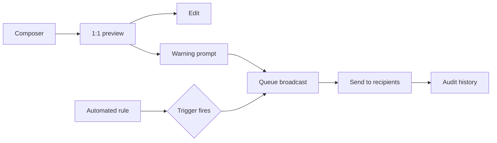
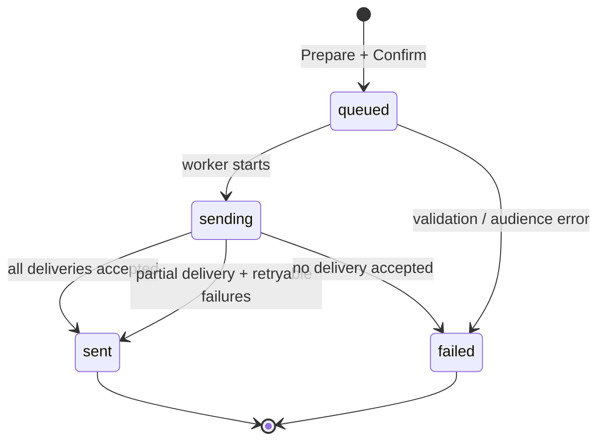

# Broadcast Management Module

The module lives in Admin → Settings → Broadcast management. It keeps the existing rate scheduler as the protected `#1` rule and adds a common model for manual messages, future automated workflows, and delivery history.

## User flow



Manual dispatch always passes through preview and warning confirmation. The UI replaces dynamic tags with sample values in preview; the Edge Function resolves them per recipient at send time.

## Dispatch state machine



Recipient rows have their own `queued → delivered → read` or `queued → failed` state. Read tracking is intentionally independent from Telegram send success, so the history table can show delivery and read metrics separately.

## Responsive wireframes

### Composer

```text
┌ Broadcast management ───────────────────────────────┐
│ [Composer]        [Automated]        [History]        │
├──────────────────────────────┬───────────────────────┤
│ 01 / Compose                  │ Live preview          │
│ Message body                 │ ┌───────────────────┐ │
│ ┌──────────────────────────┐ │ │ Telegram message │ │
│ │ {greeting}, {first_name} │ │ │ image + text     │ │
│ └──────────────────────────┘ │ └───────────────────┘ │
│ tags · audience · media      │ audience summary      │
│                  [Prepare]   │                       │
└──────────────────────────────┴───────────────────────┘
```

On small screens the preview moves below the composer and the two columns become one scrollable stack.

### Automated list

```text
┌ Automated broadcasts ────────────────────────────────┐
│ [Archived] [Create rule]                              │
├───────────────────────────────────────────────────────┤
│ Rule name       Trigger       Frequency  Status  ⋯    │
│ ✦ Current Rate  rate updated  daily      Active  #1   │
│   Tier 1        user event    once/user  Paused  edit │
└───────────────────────────────────────────────────────┘
```

The table becomes horizontally scrollable on narrow screens so trigger and schedule text never collapses into ambiguous labels.

### Audit log

```text
┌ Broadcast history ────────────────────────────────────┐
│ [Search…] [All types]                                  │
├───────────────────────────────────────────────────────┤
│ ID        Type/message       Audience  Sent  Delivery  │
│ BR-…004   Automatic + image  All       11:04 Sent      │
│                                         1,248 delivered│
├───────────────────────────────────────────────────────┤
│ 25 items / page                           ‹ 1 / 1 ›    │
└───────────────────────────────────────────────────────┘
```

## API contract

The public application contract is resource-oriented. The existing authenticated admin API should proxy these operations to the Edge Function, keeping `SUPABASE_SERVICE_ROLE_KEY` and `BROADCAST_ADMIN_SECRET` server-side.

### `POST /broadcast/manual`

Creates a queued manual broadcast after validating text, audience, and optional media metadata.

```json
{
  "body_markdown": "{greeting}, {first_name}!\n\nШинэ ханш гарлаа.",
  "media_url": "https://.../broadcasts/2026/09/rate.webp",
  "media_path": "broadcasts/2026/09/rate.webp",
  "audience_type": "all",
  "audience_filter": {}
}
```

Response: `201 { "id": "uuid", "status": "queued", "queued_at": "ISO-8601" }`.

### `GET /broadcast/automated`

Returns active rules by default. `?status=archived` returns soft-deleted rules. Rule `slot=1` is always returned first.

### `POST /broadcast/automated`

Creates a rule. `trigger_type` is one of `rate_updated`, `schedule`, or `user_event`; `trigger_config` contains the typed event/schedule data.

```json
{
  "name": "Tier 1 welcome",
  "trigger_type": "user_event",
  "trigger_config": { "event": "segment_entered", "segment": "tier-1" },
  "frequency_label": "Нэг удаа / хэрэглэгч",
  "schedule_timezone": "Asia/Ulaanbaatar",
  "template_markdown": "Тавтай морил, {first_name}!",
  "audience_type": "segment",
  "audience_filter": { "segment": "tier-1" },
  "status": "paused"
}
```

Edit uses `PATCH /broadcast/automated/{id}`. Archive uses `POST /broadcast/automated/{id}/archive` and permanent removal uses `DELETE /broadcast/automated/{id}`. Both archive and delete reject the protected current-rate rule.

### `GET /broadcast/history`

Supports `page` (default `1`), `page_size` (default `25`, maximum `100`), `search`, `type=manual|automatic`, `from`, and `to`.

```json
{
  "items": [{
    "id": "uuid",
    "type": "automatic",
    "message_snippet": "Өнөөдрийн ханш...",
    "media_attached": true,
    "target_audience": "Бүх хэрэглэгч",
    "sent_at": "2026-09-22T11:04:00+08:00",
    "delivery_status": "sent",
    "metrics": { "delivered": 1248, "read_rate": 76 }
  }],
  "page": 1,
  "page_size": 25,
  "total": 124
}
```

### Edge Function adapter

`supabase/functions/broadcast-management/index.ts` accepts the same operations as an internal action envelope: `history`, `rules`, `create_manual`, `send_manual`, `upsert_rule`, `archive_rule`, and `delete_rule`. It requires `BROADCAST_ADMIN_SECRET` (or a server-proxied equivalent) and uses the service role only inside the function.

Required secrets:

- `SUPABASE_URL`
- `SUPABASE_SERVICE_ROLE_KEY`
- `TELEGRAM_BOT_TOKEN`
- `BROADCAST_ADMIN_SECRET`

The browser must not call this function with the service role key. In this repository, the intended production wiring is the existing authenticated admin API as a proxy, or a server-side secret exchange that produces a short-lived broadcast permission.

## Data model

The migration `supabase/migrations/20260922000000_add_broadcast_management.sql` creates:

- `broadcast_rules`: reusable triggers, schedules, templates, audience filters, and soft-archive state.
- `broadcasts`: one audit record per manual or automatic dispatch, including a snapshot of the audience and aggregate metrics.
- `broadcast_deliveries`: one recipient row per dispatch for delivery/read tracking and retry diagnostics.

All three tables have RLS enabled and grant access only to `service_role`. The pinned current-rate row uses a stable ID and database constraints to prevent renaming, moving, archiving, or deleting it.
